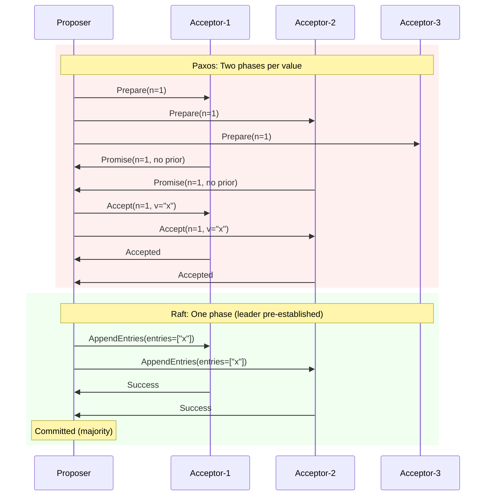

# Chapter 1: Why Consensus?

*Before we can understand Raft, we need to understand why consensus algorithms exist at all — what breaks when distributed systems try to agree, and why this problem is so fundamentally difficult that it took decades of research to solve well.*

---

## The Single-Server Comfort Zone

Let's start with something simple. You have one server. It holds your data. Clients send requests, the server processes them, everybody's happy. Life is good.

Now that server loses power. Maybe a disk fails. Maybe the operating system panics. It doesn't matter why — the result is the same: **your system is completely unavailable**. Every client gets connection refused. Every pending write is lost. If the disk was corrupted, maybe the data is gone for good.

This isn't a theoretical concern. Google's own studies found that in a cluster of 1,000 commodity servers, you should expect roughly 2–3 server failures **per day** (see *Dean & Barroso, "The Tail at Scale", Communications of the ACM, 2013*). At that scale, failure isn't an exception — it's a background constant, like rain in London.

The obvious fix is **replication**: keep copies of the data on multiple servers. If one server fails, the others continue serving requests. This is the central promise of distributed systems, and it works — but it introduces a much deeper problem than the one it solves.

## The Real Problem: Agreement

The moment you have more than one copy of the data, you need those copies to **agree**. And agreement in a distributed system is hard in ways that are genuinely surprising if you've only built single-machine software.

Consider this scenario:

```
Time 0: Server A holds x = 3, Server B holds x = 3  (in sync)
Time 1: Client-1 sends "SET x = 5" to Server A
Time 2: Client-2 sends "SET x = 7" to Server B
Time 3: The network link between A and B drops
```

Now what? Server A thinks `x = 5`. Server B thinks `x = 7`. Neither knows about the other's update. Clients connecting to different servers will see different values. This is called a **split-brain**, and it's one of the most dangerous failure modes in distributed computing.

You might think: "Just pick one server as the master and route all writes through it." Congratulations — you've independently invented the **primary-backup** model, which is indeed the foundation of most consensus algorithms. But this approach raises three immediate questions:

1. **How do you choose the master?** If the current master crashes, somebody has to take over. But how do the remaining servers agree on who? You need consensus to elect a leader — but leader election *is* consensus. This is a bootstrapping problem.

2. **How do you know the master is really dead?** If you can't reach it, maybe it crashed — or maybe the network between you and the master is slow, and the master is still happily accepting writes from other clients. If you prematurely elect a new master, you now have two masters. Split-brain again.

3. **What happened to the writes the old master accepted but hadn't yet replicated?** If the old master accepted a write, told the client "OK", and then crashed before replicating it — that write is now lost. The client thinks it succeeded, but no surviving server has it.

This is the **consensus problem**: getting a collection of machines to agree on a sequence of values, even when some machines fail, messages get lost, or the network splits into disconnected partitions. It sounds simple. It is not.

## What Makes Distributed Consensus Hard?

Three fundamental challenges make this problem far harder than it appears. Each one, on its own, would be manageable. Together, they create a combinatorial explosion of edge cases that has consumed the careers of some of the field's brightest minds.

### Challenge 1: No Global Clock

In a single-threaded program, events have a natural total order — instruction A executes before instruction B, full stop. You can reason about what happened and when. In a distributed system, **there is no shared notion of time**.

Clocks on different machines drift apart. Network Time Protocol (NTP) synchronization has bounded but non-zero error — typically a few milliseconds in a well-configured data center, but potentially much worse during network congestion or asymmetric routing. Google's TrueTime API, used internally by Spanner, achieves clock uncertainty of about 7 milliseconds with custom GPS and atomic clock hardware — and even that uncertainty is **non-zero** (see *Corbett et al., "Spanner: Google's Globally Distributed Database", OSDI 2012*).

What does this mean in practice? When two servers receive conflicting updates, **there is no oracle to tell you which happened first**. You cannot simply timestamp events and sort by time, because one server's "12:00:00.005" might be another server's "12:00:00.002" due to clock skew.

> **Note — Lamport Clocks:** Leslie Lamport showed in his 1978 paper *"Time, Clocks, and the Ordering of Events in a Distributed System"* that you don't actually need physical clocks to establish ordering. You can use logical clocks (now called Lamport timestamps) that track the *causal* ordering of events: if event A could have influenced event B, then A's timestamp is less than B's. This is the conceptual foundation that consensus algorithms build on — ordering through communication rather than through time.

### Challenge 2: Unreliable Networks

Networks in real data centers exhibit every failure mode imaginable. Here's what a survey of production network behavior looks like:

| Failure Mode | What Happens | How Common? |
|-------------|-------------|------------|
| **Message loss** | A packet is dropped by a switch, router, or kernel buffer | Routine during congestion |
| **Message duplication** | A retransmission creates a second copy of a request | Common with TCP retransmits |
| **Message reordering** | Packets arrive in a different order than sent | Common with multi-path routing |
| **Network partition** | A group of servers is severed into isolated subsets | Uncommon but devastating |
| **Asymmetric partition** | Server A can reach B, but B cannot reach A | Rarer, but well-documented |
| **Gray failure** | Network is *mostly* working but drops some packets sporadically | Insidious and hard to detect |

A correct consensus algorithm must handle **all of these simultaneously**. Not one at a time, not in convenient combinations — all of them, at once, under load, during peak traffic, on a bad day.

> **Note — The Fallacies of Distributed Computing:** Peter Deutsch's famous "Eight Fallacies of Distributed Computing" (1994) lists the assumptions that engineers new to distributed systems tend to make: the network is reliable, latency is zero, bandwidth is infinite, the network is secure, topology doesn't change, there is one administrator, transport cost is zero, the network is homogeneous. Every consensus algorithm is essentially a response to reality violating these assumptions.

**How common are partitions?** More common than you might think. Bailis and Kingsbury surveyed real-world partition reports and found them in every major cloud provider and data center vendor (see *Bailis & Kingsbury, "The Network is Reliable", ACM Queue, 2014*). Partitions can be caused by switch firmware bugs, misrouted BGP announcements, overloaded network controllers, or even a well-meaning operator accidentally unplugging the wrong cable.

### Challenge 3: Process Failures

Servers crash. They run out of memory, their disks fill up, their power supplies fail, and the operating system kernel panics. A correct algorithm must tolerate any **minority** of servers failing at any time, without losing committed data and without blocking the remaining servers from making progress.

But failures aren't just binary (working / dead). In practice, you also see:

- **Slow servers**: A server under memory pressure or doing garbage collection might respond to messages, but after a 10-second delay. From the outside, this is nearly indistinguishable from a crash.
- **Correlated failures**: A power outage might take down three servers in the same rack simultaneously. A kernel bug in a new OS update might crash every server that applies it.
- **Partial failures**: A server's network interface works but its disk has failed. It can receive messages but can't persist state. Is it "up" or "down"?

> **Note — The MTBF Fallacy:** Server vendors quote mean time between failures (MTBF) of hundreds of thousands of hours. This might make failures seem rare. But MTBF is per-server. In a cluster of 1,000 servers, each with an MTBF of 250,000 hours (~28 years), the expected time between **any** failure in the cluster is 250 hours — roughly 10 days. At 10,000 servers, a failure happens roughly every day. Scale makes individual reliability irrelevant; what matters is the system's ability to **tolerate** failure.

## Impossibility Results: The Theoretical Boundaries

Before diving into algorithms, it's important to understand the theoretical boundaries of what's possible. Two landmark theorems frame the entire field.

### The FLP Impossibility Theorem (1985)

In one of the most important results in distributed computing, Michael Fischer, Nancy Lynch, and Michael Paterson proved that **no deterministic algorithm can guarantee consensus in a fully asynchronous system if even a single process can fail** (see *Fischer, Lynch, & Paterson, "Impossibility of Distributed Consensus with One Faulty Process", Journal of the ACM, 1985*).

Let's unpack what this means:

- **Deterministic**: the algorithm's behavior is fully determined by its inputs and current state — no randomization allowed.
- **Asynchronous**: there is no upper bound on how long a message can take to be delivered. Messages will eventually arrive, but you can't say when.
- **One faulty process**: even a single crash is enough to make the problem unsolvable.

The key insight behind FLP is that in an asynchronous system, **you can never distinguish a crashed process from a very slow one**. Any algorithm that waits for a possibly-crashed process might wait forever, violating liveness (progress). Any algorithm that gives up on a possibly-slow process might exclude a perfectly healthy server, leading to inconsistency.

This sounds like it makes consensus outright impossible. So how do systems like etcd, Consul, and CockroachDB work in practice? They work around FLP in two ways:

1. **Randomization**: Raft uses randomized election timeouts. When a follower suspects the leader has crashed, it waits a random amount of time before starting an election. This randomness breaks the symmetry that FLP exploits — it becomes overwhelmingly unlikely that all candidates will interfere with each other forever.

2. **Partial synchrony**: Real networks aren't fully asynchronous. Messages do arrive within some bounded time — not always, but eventually. Dwork, Lynch, and Stockmeyer showed that consensus is solvable in a **partially synchronous** model, where there exists some unknown bound on message delay that eventually holds (see *Dwork, Lynch, & Stockmeyer, "Consensus in the Presence of Partial Synchrony", Journal of the ACM, 1988*). Raft implicitly relies on this: if message delays are bounded, leaders can maintain authority through heartbeats, and elections will eventually complete.

> **Note — FLP in Practice:** The practical implication of FLP is not that consensus is impossible to achieve, but that no consensus algorithm can **guarantee** liveness (termination) in all possible executions. Every practical algorithm (including Raft) has executions where it makes no progress — for example, if election timeouts happen to collide repeatedly. FLP tells us that these pathological executions can never be fully eliminated by a deterministic protocol, only made vanishingly unlikely through randomization.

### The CAP Theorem (2000 / 2002)

Eric Brewer conjectured in his 2000 keynote, and Seth Gilbert and Nancy Lynch formally proved in 2002, that a distributed data store can provide at most two of the following three guarantees simultaneously:

- **Consistency (C)**: every successful read returns the result of the most recent successful write. All clients see the same linear history of operations.
- **Availability (A)**: every request to a non-failing node receives a response. No request is left hanging.
- **Partition tolerance (P)**: the system continues to operate even when arbitrary messages between nodes are lost or delayed.

Since network partitions are **inevitable** in any real distributed system (you cannot prevent switches from failing), the "P" is not really optional. The practical choice is between:

- **CP systems** (consistent, partition-tolerant): during a network partition, the minority side **cannot** accept writes. Reads and writes only succeed on the side that has a majority of nodes. This is what Raft provides.
- **AP systems** (available, partition-tolerant): during a partition, **both** sides continue accepting reads and writes, but with no guarantee that they agree. Conflicts are resolved after the partition heals, using techniques like last-writer-wins, vector clocks, or CRDTs. DynamoDB and Cassandra are AP systems.

> **Note — CAP Nuances:** In practice, the CAP theorem is often oversimplified. Brewer himself wrote a follow-up article, *"CAP Twelve Years Later: How the 'Rules' Have Changed"* (IEEE Computer, 2012), arguing that the binary choice between C and A is overstated. Modern systems can be consistent when the network is healthy and gracefully degrade during partitions. Raft, for example, is highly available in normal operation — it only sacrifices availability on the minority side during a partition, which is often an acceptable trade-off.

## The Byzantine Spectrum

Not all failures are created equal. Computer scientists categorize failures into a hierarchy based on how badly misbehaving a faulty process can be:

| Failure Model | What Can Go Wrong? | Typical Setting | Example Algorithms |
|--------------|-------------------|-----------------|-------------------|
| **Crash-fail** | Processes stop cleanly and never resume | Controlled testing | Basic Paxos |
| **Crash-recovery** | Processes crash and may restart with persistent state intact | Data centers | **Raft**, Multi-Paxos, Zab |
| **Byzantine** | Processes may behave arbitrarily — including lying, sending contradictory messages, or colluding with other faulty processes | Blockchain, adversarial networks | PBFT, Tendermint, HotStuff |

Raft operates in the **crash-recovery model**: a server may crash at any time, but when it restarts, it behaves correctly and can recover its state from durable storage. This is the realistic model for data center software — hardware fails, but doesn't lie. (If you need to tolerate malicious behavior, you need a Byzantine fault-tolerant algorithm, which is significantly more expensive — typically requiring 3f+1 servers to tolerate f Byzantine faults, versus 2f+1 for crash faults.)

## Before Raft: A Brief History

Raft didn't emerge from a vacuum. It's the culmination of 25 years of consensus research, and understanding its predecessors helps explain why it was designed the way it was.

### Paxos (1989 / 1998)

Leslie Lamport's Paxos algorithm was the first practical solution to the consensus problem. Lamport submitted the paper in 1989, but it was considered too difficult to understand and wasn't published until 1998 — in a journal rather than a conference — and even then, many reviewers found it hard to follow.

Paxos proves that consensus is achievable with crash-fault tolerance and describes a protocol that is provably safe. It has been deployed in production systems like **Google's Chubby** lock service (the coordination layer behind many Google services) and **Microsoft's Azure Storage**.

However, Paxos has a well-deserved reputation for being **extremely difficult to understand and implement correctly**. The original paper (*The Part-Time Parliament*, ACM TOCS, 1998) described the algorithm through an allegory about a fictional Greek parliament on the island of Paxos, which many readers found more confusing than clarifying. Lamport later published a stripped-down version (*Paxos Made Simple*, 2001) that is more accessible, but still focuses only on single-decree consensus — agreeing on one value.

The extension to **Multi-Paxos** (agreeing on a sequence of values, which is what you need for a replicated state machine) was never formally specified by Lamport. Every production implementation — Google's, Microsoft's, Amazon's — interprets the Multi-Paxos sketch differently, making it difficult to verify correctness or compare implementations.

As Ongaro and Ousterhout wrote in the Raft paper:

> *"We hypothesize that Paxos' opaqueness derives from its choice of the single-decree subset as its foundation. Single-decree Paxos is dense and subtle: it is divided into two stages that do not have simple intuitive explanations and cannot be understood independently. Because of this, it is difficult to develop intuitions about why the single-decree protocol works. The composition rules for Multi-Paxos add significant additional complexity and subtlety."*
>
> — Diego Ongaro & John Ousterhout, *"In Search of an Understandable Consensus Algorithm"*, USENIX ATC 2014

#### Paxos vs Raft: A Side-by-Side Comparison

To make the complexity difference concrete, here is how each algorithm handles a single value proposal:

| Aspect | Paxos (Single-Decree) | Raft |
|--------|----------------------|------|
| **Phases** | Two phases: Prepare → Accept | Single phase: AppendEntries (leader already established) |
| **Leader role** | Any proposer can propose at any time; no stable leader required | Strict leader — all proposals go through one node |
| **Proposal numbering** | Each proposer picks a globally unique proposal number; proposers compete | Terms are monotonically increasing; only one leader per term |
| **Learning a value** | Proposer must discover previously accepted values during Prepare; may adopt them | Leader's log is authoritative; followers overwrite conflicts |
| **Log gaps** | Multi-Paxos can have holes — slot *k+1* decided before slot *k* | Logs are sequential with no gaps (Log Matching Property, see [Chapter 2](02-raft-fundamentals.md)) |
| **Membership changes** | Not specified in the original paper; each implementation invents its own | Joint consensus — a formally specified two-phase transition (see [Chapter 3](03-raft-advanced-theory.md)) |
| **Understandability** | Ongaro's study: 25th percentile score | Ongaro's study: 67th percentile score |



The difference is even starker at the implementation level. A correct Paxos implementation must handle proposer conflicts (two proposers racing with different proposal numbers), value adoption (a proposer discovering that a different value was already accepted at a slot), and liveness failures (dueling proposers that keep preempting each other — the "livelock" problem). Raft's strong leader eliminates all of these by construction.

### Viewstamped Replication (1988)

Brian Oki and Barbara Liskov published the Viewstamped Replication (VR) protocol in 1988 — technically predating Paxos. VR uses a **primary-backup architecture** with view changes (a mechanism for replacing a failed primary). It shares many structural similarities with Raft: both have a distinguished leader, both use a monotonically increasing epoch number (Raft calls them "terms", VR calls them "views"), and both require a majority for commits.

VR was less widely known than Paxos in the academic literature, but Barbara Liskov revisited and simplified the protocol in 2012 (see *"Viewstamped Replication Revisited", Liskov & Cowling, 2012*), making the connections to Raft explicit.

### Zab — ZooKeeper Atomic Broadcast (2011)

The Zookeeper Atomic Broadcast protocol powers Apache ZooKeeper, which for many years was the default coordination service in the Hadoop ecosystem. Zab provides **total ordering** of messages, leader election, and crash recovery.

Zab differs from Paxos in that it explicitly separates the **broadcast** (normal operation) from **recovery** (electing a new leader after failure), which makes it somewhat easier to implement. However, Zab is tightly coupled to ZooKeeper's data model and tree-structured namespace. It's more an implementation detail of ZooKeeper than a general-purpose reusable library.

### Raft (2014)

Diego Ongaro and John Ousterhout designed Raft at Stanford University with a primary design goal that no consensus algorithm had prioritized before: **understandability**.

Their key technique was **decomposition**: instead of describing consensus as a monolithic algorithm (as Paxos does), they broke it into three cleanly separated sub-problems:

1. **Leader election** — how a single leader is chosen from the cluster. Leaders make the system simpler because only the leader needs to make decisions; followers just replicate what the leader says.
2. **Log replication** — how the leader accepts client commands, appends them to its log, and replicates that log to all followers.
3. **Safety** — the formal proof that these mechanisms never produce inconsistent results. Specifically, if any server has applied a log entry at a given index, no other server will ever apply a different entry at that index.

Ongaro validated the understandability claim with a user study: Stanford students were taught both Raft and Paxos, then tested on their understanding. Raft scored significantly higher (see *Ongaro & Ousterhout, "In Search of an Understandable Consensus Algorithm", USENIX ATC, 2014*, §9).

This decomposition makes Raft dramatically easier to teach, implement, debug, and verify compared to Paxos. It has become the **dominant consensus algorithm** in modern infrastructure software, powering:

- **etcd** — the configuration store behind Kubernetes
- **CockroachDB** — a distributed SQL database
- **TiKV** — the storage layer of TiDB
- **Consul** — HashiCorp's service mesh and KV store
- **RethinkDB**, **ScyllaDB**, **Dgraph**, and many others

## What Consensus Gives You

With a correct consensus algorithm, you can build a surprisingly wide range of distributed primitives. All of them boil down to the same core idea: a group of machines agreeing on a **sequence of operations** and applying them in the same order.

| What You Can Build | How It Uses Consensus | Real-World Example |
|-------------------|----------------------|-------------------|
| **Replicated state machine** | All replicas apply the same commands in the same order → identical state | CockroachDB (SQL), TiKV (KV) |
| **Distributed lock service** | Agree on who holds a lock, with automatic release on failure | Google Chubby, Apache ZooKeeper |
| **Leader election** | Agree on which process is the primary in a primary-backup system | Kubernetes controller manager |
| **Configuration store** | Agree on a set of key-value pairs representing system config | etcd (Kubernetes), Consul |
| **Atomic broadcast** | Agree on a total order for all messages | Apache Kafka (with KRaft) |
| **Sequence generators** | Agree on monotonically increasing sequence numbers | Globally unique ID generation |
| **Distributed transactions** | Agree on whether a multi-shard transaction commits or aborts | CockroachDB, Spanner |

> **Note — The Replicated State Machine approach:** The insight that consensus + deterministic replay = replicated state machine was formalized by Fred Schneider in *"Implementing fault-tolerant services using the state machine approach"* (ACM Computing Surveys, 1990). If you have N machines, each starting from the same initial state and applying the same sequence of commands in the same order, then after processing command #k, all N machines will have identical state — even though they are running on completely independent hardware. This is the idea behind almost every consensus-based system.

## Further Reading

If you want to go deeper on the theory behind this chapter, here are the key papers:

| Paper | Year | Why It Matters |
|-------|------|---------------|
| *Lamport, "Time, Clocks, and the Ordering of Events"* | 1978 | Logical clocks and the happens-before relation |
| *Fischer, Lynch, & Paterson, "Impossibility of Distributed Consensus with One Faulty Process"* | 1985 | The FLP impossibility theorem |
| *Lamport, "The Part-Time Parliament"* | 1998 | The Paxos algorithm |
| *Lamport, "Paxos Made Simple"* | 2001 | Simplified Paxos description |
| *Brewer, "CAP Twelve Years Later"* | 2012 | A nuanced view of the CAP theorem |
| *Ongaro & Ousterhout, "In Search of an Understandable Consensus Algorithm"* | 2014 | The Raft paper |
| *Schneider, "Implementing Fault-Tolerant Services Using the State Machine Approach"* | 1990 | The replicated state machine framework |

---

*Next: [Chapter 2 — Raft Fundamentals](02-raft-fundamentals.md) dives into how Raft actually works: terms, elections, log replication, and the safety invariants that make it all correct.*
