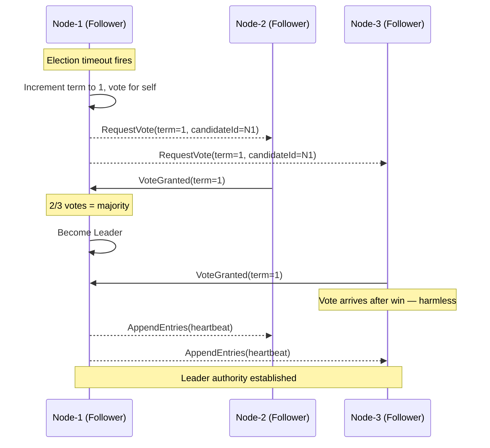
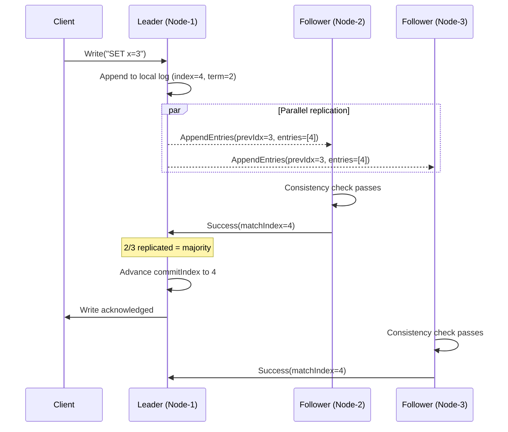

# Chapter 2: Raft Fundamentals

*This chapter presents the core Raft protocol: how leaders are elected, how logs are replicated, and why the algorithm is safe. If you read only one chapter of this book, make it this one — every concept here maps directly to an API in the library, and everything else builds on this foundation.*

---

## The Big Picture

In Chapter 1, we saw that consensus is hard. Raft makes it tractable by **decomposition** — breaking a monolithic problem into three smaller, more manageable sub-problems:

```
┌───────────────────────────────────────────────────┐
│                  RAFT PROTOCOL                    │
├─────────────────┬────────────────┬────────────────┤
│ Leader Election │ Log Replication│    Safety      │
│                 │                │                │
│ Who leads?      │ How data flows │ Why it's       │
│ When to change? │ from leader    │ always correct │
│                 │ to followers   │                │
└─────────────────┴────────────────┴────────────────┘
```

This isn't just an organizational trick for the paper. It's a genuine architectural principle that makes Raft implementations cleaner: you can implement and test election logic independently of replication logic, and both independently of safety proofs. The code in this library reflects this separation directly.

### Roles: The Three States of a Raft Node

At any given time, every node in a Raft cluster is in one of three roles:

| Role | Responsibility | Analogy |
|------|---------------|---------|
| **Leader** | Accepts client requests, replicates log entries to followers, decides when entries are committed | The project manager who coordinates all work |
| **Follower** | Passive — responds to RPCs from the leader, applies committed entries | A team member who follows the manager's instructions |
| **Candidate** | Temporarily seeking election to become the new leader | A team member running for the vacant manager position |

In normal operation, there is exactly **one leader** and all other nodes are followers. The leader handles all client requests — if a follower receives a client request, it either redirects the client to the leader or proxies the request on the client's behalf. This simplification is deliberate: having a single point of decision-making eliminates the need for complex conflict resolution between peers.

> **Note — Strong Leader Model:** Raft's commitment to a single leader is a conscious design choice. Quoting the Raft paper: *"Raft uses a stronger form of leadership than other consensus algorithms. For example, log entries only flow from the leader to other servers."* This is in contrast to algorithms like EPaxos (Egalitarian Paxos, Moraru et al., SOSP 2013), where any node can propose values. The strong leader model is less flexible but dramatically simpler to reason about and implement correctly.

## Terms: Raft's Logical Clock

Since there's no global physical clock (as we discussed in Chapter 1), Raft needs its own way to distinguish "old" information from "new" information. It solves this with **terms**.

A term is a monotonically increasing integer that acts as a **logical clock** for the cluster. Think of terms as "reign numbers" or "epochs" — each term represents a period of time during which one leader (at most) holds authority.

```
    Term 1          Term 2      Term 3      Term 4
┌──────────────┐┌──────────┐┌──────────┐┌──────────────┐
│  Election →  ││ Election ││ Election ││  Election →  │
│  Leader A    ││ (no win) ││ Leader B ││  Leader C    │
│  Normal ops  ││          ││ Normal   ││  Normal ops  │
└──────────────┘└──────────┘└──────────┘└──────────────┘
```

Each term begins with an election. If a candidate wins, it serves as leader for the rest of the term. If no candidate wins (a "split vote" — more on this shortly), the term ends with no leader and a new term begins immediately.

### The Term Rule: How Terms Keep the Cluster Sane

**Key invariant: there is at most one leader per term.** This is guaranteed by the voting rule — each node votes for at most one candidate per term, and a candidate needs a majority to win. Since majorities overlap (any two majorities share at least one node), two candidates cannot both get a majority in the same term.

Terms are also the mechanism Raft uses to **detect stale information**. The rules are simple:

1. Every RPC includes the sender's current term.
2. If a node receives a message with a **higher** term than its own, it immediately updates its term to the higher value and reverts to Follower state. The reasoning: if someone else has moved to a higher term, any leadership or candidacy in my current term is obsolete.
3. If a node receives a message with a **lower** term than its own, it rejects the message. The reasoning: the sender is operating on stale information.

> **Note — Terms vs. Lamport Clocks:** If you're familiar with Lamport's logical clocks (Chapter 1), you might notice that terms work differently. Lamport clocks increment on every local event and every message send/receive. Raft terms only increment when an election starts. This makes terms coarser-grained — they don't capture all causal relationships — but within Raft's architecture, that's sufficient because all operations are mediated through the leader, and the leader's term serves as a definitive ordering mechanism.

In the library, a term is represented as a `Long`:

```scala
// From the Raft state model
case class Follower(
  term: Long,
  votedFor: Option[NodeId],
  leaderId: Option[NodeId]
) extends NodeState
```

The `term` and `votedFor` fields together form the **hard state** — the information that must be persisted to durable storage before responding to any RPC. If a node crashes and restarts, it must remember its current term and who it voted for to prevent voting twice in the same term.

## Leader Election

### When Does an Election Start?

Every follower runs an **election timer** — a countdown that resets every time the follower hears from the leader (via a heartbeat or AppendEntries RPC). If the timer expires without hearing from the leader, the follower concludes that the leader has failed and starts an election.

The election timeout is **randomized** — each node independently picks a random duration between `electionTimeoutMin` and `electionTimeoutMax` (typically 150–300ms). Randomization is the key mechanism that prevents election conflicts, as we'll see shortly.

The election process has four steps:

1. The follower **increments its term** by one.
2. It **transitions** from Follower to Candidate.
3. It **votes for itself** (and persists this vote to stable storage).
4. It **sends `RequestVote` RPCs** to all other nodes in the cluster.

The following diagram shows the complete election sequence for a 3-node cluster:



```scala
import raft.state.*
import raft.state.NodeState.*
import raft.message.RaftMessage.*
import raft.logic.RaftLogic
import raft.effect.Effect.*

val n1 = NodeId("node-1")
val config = RaftConfig(localId = n1, preVoteEnabled = false)

// An election timeout fires — the follower starts an election
val follower = Follower(term = 0, votedFor = None, leaderId = None)
val election = RaftLogic.onMessage(follower, ElectionTimeout, config, 0, 0, 3)
// election.state → Candidate(term = 1, votesReceived = {node-1})
// election.effects include:
//   PersistHardState(1, Some(node-1))
//   Broadcast(RequestVoteRequest(term=1, candidateId="node-1", ...))
```

### How Does Voting Work?

When a node receives a `RequestVote` RPC, it decides whether to grant its vote based on three conditions. **All three must be satisfied**:

1. **The candidate's term is ≥ the voter's current term.** If the candidate has a lower term, it's using stale information and gets rejected outright.

2. **The voter hasn't already voted for someone else in this term.** Each node votes for at most one candidate per term. This is enforced by persisting the `votedFor` field to stable storage — if the node crashes and restarts, it remembers its vote. Without this persistence, a restarted node might vote twice, allowing two leaders in the same term.

3. **The candidate's log is at least as up-to-date as the voter's log.** This is called the **election restriction**, and it's the most important safety mechanism in Raft. The comparison works lexicographically on `(lastLogTerm, lastLogIndex)`:

```
Example 1: Same last term, candidate has more entries
  Candidate's log ends at (term=3, index=7)
  Voter's log ends at     (term=3, index=5)
  → Candidate is more up-to-date → GRANT vote

Example 2: Same last term, candidate has fewer entries
  Candidate's log ends at (term=3, index=4)
  Voter's log ends at     (term=3, index=5)
  → Voter is more up-to-date → DENY vote

Example 3: Different last terms (term takes priority over index)
  Candidate's log ends at (term=2, index=10)
  Voter's log ends at     (term=3, index=3)
  → Voter has higher last term → DENY vote (even though candidate has more entries!)

Example 4: Candidate has higher last term
  Candidate's log ends at (term=4, index=2)
  Voter's log ends at     (term=3, index=8)
  → Candidate has higher last term → GRANT vote
```

**Why does term take priority over index?** Because entries from a higher term are guaranteed to be more recent than entries from a lower term. An entry at term 4, index 2 was created after every entry from terms 1–3, regardless of how many entries those earlier terms produced. The term number is the more reliable indicator of recency.

> **Note — The election restriction is the linchpin of safety.** Without this check, a candidate with a stale, incomplete log could win an election and overwrite committed entries on followers — violating safety. The Raft paper dedicates an entire section (§5.4) to proving that this restriction is sufficient to ensure that every elected leader has all committed entries. Read the proof in the original paper if you want to understand this deeply — it's one of the clearest parts of the paper.

### How Does an Election End?

An election terminates in one of three ways:

| Outcome | What Happened | Next State |
|---------|-------------|------------|
| **Win** | The candidate receives votes from a strict majority (more than half of all nodes, including its own self-vote) | Becomes **Leader**, immediately sends heartbeats to establish authority |
| **Lose** | An `AppendEntries` RPC arrives from another node claiming to be leader with a term ≥ the candidate's term | Becomes **Follower** of the new leader |
| **Timeout** | The election timer expires without achieving a majority or receiving an AppendEntries | Starts a **new election** (increments term, votes for self again) |

```scala
// Receiving a vote and winning the election
val candidate = Candidate(term = 1, votesReceived = Set(n1))
val vote = RequestVoteResponse(term = 1, voteGranted = true, isPreVote = false)
val afterVote = RaftLogic.onVoteResponse(candidate, NodeId("node-2"), vote, config, 3)
// In a 3-node cluster, 2 votes = majority
// afterVote.state → Leader(term = 1)
// afterVote.effects → [BecomeLeader, ...]
```

### Avoiding Split Votes

A **split vote** occurs when multiple candidates start elections simultaneously and split the votes so that no candidate achieves a majority. For example, in a 5-node cluster, if three nodes all become candidates at the same time, each might get only its own vote plus one other — no majority.

Raft avoids this through **randomized election timeouts**. Each node picks a random timeout between `electionTimeoutMin` and `electionTimeoutMax`. The node with the shortest timeout starts its election first and usually wins before the others even start — because it sends `RequestVote` to everyone, locks in their votes (each node votes for at most one candidate per term), and achieves a majority before the slower nodes' timers expire.

The randomization doesn't guarantee that split votes never happen, but it makes them rare enough that the system makes progress rapidly. In the unlikely event of a split vote, the losing candidates' timers will fire again (with fresh random durations), and the next round almost always produces a winner.

> **Note — Raft's Solution to FLP:** This randomized timeout mechanism is precisely how Raft sidesteps the FLP impossibility theorem we discussed in Chapter 1. FLP proves that no *deterministic* protocol can guarantee consensus progress. By introducing randomness, Raft ensures that the pathological case (where candidates perpetually interfere with each other) is vanishingly improbable, even though it's theoretically possible.

## Log Replication

Once a leader has been elected, it needs to do something useful: accept client commands and replicate them to all followers. This is the **log replication** phase of Raft, and it's where the actual work of a consensus system happens.

### The Replicated Log

Raft's core data structure is the **replicated log** — an ordered sequence of entries that every node applies to its state machine in the same order:

```
┌─────────────────────────────────────────────────────┐
│  Index:   1       2       3       4       5         │
│  Term:    1       1       1       2       2         │
│  Data:    SET x=1 SET y=2 DEL z   SET x=3 NO-OP    │
│  Status:  applied applied applied committed pending │
└─────────────────────────────────────────────────────┘
```

Each entry contains three pieces of information:

- **Index**: the position.in the log (1-based, monotonically increasing, with no gaps)
- **Term**: the leader's term number when this entry was created. Don't confuse this with the term in which the entry was committed — an entry might be created by a leader in term 2 but only committed after a new leader takes over in term 3.
- **Command**: the application data — a serialized representation of a client command (e.g., "SET x = 1" in a key-value store)

In the library, log entries are represented by the `Log` case class:

```scala
import raft.state.Log

// A client command entry
val entry = Log.command(index = 1, term = 1, data = "SET x=1".getBytes)

// A no-op entry (leaders append one at the start of each term)
val noop = Log.noOp(index = 1, term = 1)
```

> **Note — Why No-Ops?** When a new leader takes over, it doesn't know which of the previous leader's entries have been committed. The Raft paper's solution: the new leader appends a **no-op entry** from its own term and replicates it. Once this no-op is committed, the leader knows that all prior entries are also committed (due to the Log Matching property). Without this mechanism, a new leader might have to delay client requests until it can determine the commit status of old entries — which could take an arbitrarily long time.

### AppendEntries: The Workhorse RPC

The leader replicates entries to followers using `AppendEntries` RPCs. This is the most frequently used RPC in Raft — it handles both log replication and heartbeats (an empty `AppendEntries` with no new entries serves as a heartbeat).

The RPC contains everything the follower needs to verify consistency and append new entries:

```
Leader sends to Follower:
  ┌──────────────────────────────────────────────────┐
  │  AppendEntriesRequest                            │
  │    term           = 2   (leader's current term)  │
  │    leaderId       = "node-1"                     │
  │    prevLogIndex   = 3   (index just before the   │
  │                          new entries)             │
  │    prevLogTerm    = 1   (term of entry at         │
  │                          prevLogIndex)            │
  │    entries        = [{idx=4, term=2, "SET x=3"}] │
  │    leaderCommit   = 3   (leader's commit index)  │
  └──────────────────────────────────────────────────┘
```

The full replication cycle looks like this:



**The consistency check**: before accepting new entries, the follower verifies that it has an entry at `prevLogIndex` with term `prevLogTerm`. This is like a **hash chain** — the leader is asserting "I believe your log matches mine through index 3, and specifically that the entry at index 3 was created in term 1". If the follower agrees, it knows the logs are consistent up to that point and can safely append the new entries.

If the follower **doesn't** have a matching entry at `prevLogIndex`, it rejects the request. The leader then decrements `prevLogIndex` and retries. This "searching backward" continues until the leader finds the point of agreement. In practice, this converges quickly — usually the follower is only a few entries behind.

### The Log Matching Property

The consistency check in `AppendEntries` guarantees two powerful invariants that form the **Log Matching Property**:

1. **If two entries in different logs have the same index and term, they store the same command.** Why? Because a leader creates at most one entry per index in a given term, and log entries never change position once created.

2. **If two entries in different logs have the same index and term, then all preceding entries are also identical.** Why? Because `AppendEntries` verifies the preceding entry before appending. By induction, if entry *k* matches, then entry *k-1* must have matched when entry *k* was appended, and so on all the way back to entry 1.

These two invariants together mean that once you know the logs agree at any single point, you know they agree on their entire prefix. This is an incredibly powerful property — it means that log consistency can be verified in O(1) per RPC, rather than requiring a comparison of the entire log.

> **Note — This is where Raft shines compared to Paxos.** In Multi-Paxos, entries at different indices can be decided independently by different leaders, which means the log can have "holes" — positions where the decision is not yet finalized while later positions are. This creates significant implementation complexity. In Raft, the leader always fills the log sequentially, and the Log Matching Property guarantees that the prefix of the log is always consistent. This simplification is a direct consequence of Raft's strong leader model.

### Commit Rules: When Is a Write Durable?

A log entry is **committed** when it has been replicated to a majority of servers. This is the moment when the entry becomes durable — even if the leader crashes, the entry will survive because a majority of servers have it, and any future leader must be elected by a majority that includes at least one server with the entry.

The leader tracks each follower's replication progress via a `matchIndex` map:

```
Leader (5-node cluster):
  matchIndex = { node-2 → 7, node-3 → 5, node-4 → 7, node-5 → 3 }
  Leader's own log length = 7

  Sorted match indices (including leader): [3, 5, 7, 7, 7]
  Commit index = median = 7  ← entry at index 7 is replicated on 3/5 nodes

  But wait — we must also check the term.
```

**The Current-Term Commit Rule**: A leader may only commit an entry from its **own term**. Why? Consider this subtle bug (described in §5.4.2 of the Raft paper):

1. Leader A in term 2 replicates an entry at index 3 to a minority (2 of 5 nodes) and then crashes.
2. Leader B in term 3 gets elected, writes new entries, but also crashes before replicating them.
3. Leader A comes back, wins election for term 4, and now tries to commit the entry at index 3 from term 2.

If Leader A commits that entry by counting replicas (2 nodes already have it, A makes 3 = majority), there's a problem: Leader B in term 3 might have overwritten that entry on some nodes. So a leader must never commit entries from previous terms directly — it can only commit by first committing an entry from its own (current) term, which implicitly commits all prior entries.

In practice, this means the leader appends a **no-op entry** at the start of each term and waits for it to be committed. Once the no-op commits, all prior entries are safe.

## Safety Properties

Raft guarantees five formal safety properties. Together, they ensure that the replicated state machine behaves as if there were a single server processing commands in order — even though the state machine is running on multiple independent machines that may fail at any time.

| Property | Formal Statement |
|----------|-----------------|
| **Election Safety** | At most one leader can be elected in a given term |
| **Leader Append-Only** | A leader never overwrites or deletes entries in its own log; it only appends new entries |
| **Log Matching** | If two logs contain an entry with the same index and term, then the logs are identical in all entries up through that index |
| **Leader Completeness** | If a log entry is committed in a given term, then that entry will be present in the logs of the leaders for all higher-numbered terms |
| **State Machine Safety** | If a server has applied a log entry at a given index to its state machine, no other server will ever apply a different log entry for that index |

The **Leader Completeness** property is the most subtle and the most important. It's what guarantees that committed entries are never lost, even across leader changes. The mechanism that ensures it is the **election restriction** — since a candidate must have a log that is at least as up-to-date as a majority of servers, and any committed entry is present on a majority of servers, any successful candidate must have every committed entry.

> **Note — Formal Verification:** The safety properties of Raft have been formally verified using TLA+ (Lamport's specification language) by Ongaro himself. The TLA+ specification is publicly available and covers every aspect of the protocol, including edge cases around leader election, log compaction, and membership changes. If you want the highest level of confidence in Raft's correctness, studying the TLA+ spec is the way to go.

## The State Machine

The state machine is the **application-specific logic** that consumes committed log entries. It's the whole reason the consensus algorithm exists — the replicated log is just a vehicle for ensuring that every node applies the same commands in the same order.

```
                                     ┌──────────────┐
  Client Command ──→ Leader Log ──→ │ State Machine │──→ Application State
                                     │              │
                                     │ apply(entry) │    "x" → "1"
                                     │              │    "y" → "2"
                                     └──────────────┘
```

The contract is simple: the state machine is a **deterministic function** of the log. Given the same sequence of entries, every state machine on every node will produce the same output state. This is the fundamental guarantee of the replicated state machine approach (Schneider, 1990 — referenced in Chapter 1).

In this library, the state machine is captured by the `StateMachine` SPI (Service Provider Interface), which we'll cover in detail in Chapter 6:

```scala
trait StateMachine[F[_], R]:
  def apply(log: Log): F[R]
  def snapshot: F[Array[Byte]]
  def restore(data: Array[Byte]): F[Unit]
```

## Heartbeats and Liveness

The leader periodically sends **heartbeat** messages to all followers. A heartbeat is simply an `AppendEntries` RPC with an empty `entries` list. Despite carrying no new data, heartbeats serve two critical roles:

1. **Preventing unnecessary elections**: Followers reset their election timer when they receive a heartbeat. Without heartbeats, followers would time out and start elections even though the leader is alive and well.

2. **Propagating the commit index**: The `leaderCommit` field in every `AppendEntries` (including heartbeats) tells followers "you can safely apply entries up to this index". This is how followers learn that entries have been committed.

### Timing Requirements

The heartbeat interval must be **significantly shorter** than the election timeout. The Raft paper states the timing requirement as:

```
broadcastTime ≪ electionTimeout ≪ MTBF

where:
  broadcastTime = average time to send RPCs to all nodes (~0.5–20ms in a LAN)
  electionTimeout = time before a follower starts an election (150–300ms)
  MTBF = mean time between server failures (months to years)
```

The first inequality (`broadcastTime ≪ electionTimeout`) ensures that heartbeats arrive well before the election timer expires, so followers don't start spurious elections during normal operation. The second inequality (`electionTimeout ≪ MTBF`) ensures that the system can elect a new leader and make progress before another failure occurs.

In the library, these are configured via `RaftConfig`:

```scala
val config = RaftConfig(
  localId = NodeId("node-1"),
  electionTimeoutMin = 150.millis,
  electionTimeoutMax = 300.millis,
  heartbeatInterval = 50.millis
)
```

## Putting It All Together: A Complete Round-Trip

Let's trace a single client write through the entire Raft protocol to see how all the pieces fit together:

```
1. Client sends "SET x = 42" to the leader (or a follower redirects to the leader)
2. Leader creates a Log entry: Log(index=8, term=3, data="SET x=42")
3. Leader appends the entry to its own log
4. Leader sends AppendEntries(prevLogIndex=7, entries=[entry]) to all followers
5. Each follower verifies prevLogIndex/prevLogTerm, appends the entry, responds success
6. Leader receives successful responses from a majority (including itself)
7. Leader advances commitIndex to 8
8. Leader applies entry 8 to its state machine, returns result to client
9. Next heartbeat carries leaderCommit=8 to followers
10. Followers apply entry 8 to their state machines
```

If a follower is slow or its response is lost, the leader retries the `AppendEntries` in the next heartbeat cycle. If the leader crashes after step 6, the entry is safe on a majority of nodes, and the next leader will re-replicate it and complete the commit.

## Summary

| Concept | Mechanism | Key Insight |
|---------|-----------|-------------|
| **Logical time** | Terms (monotonically increasing integers) | Detects stale leaders and obsolete messages |
| **Leader election** | Randomized timeouts + majority vote | Only one leader per term; FLP-safe via randomization |
| **Log structure** | Indexed, term-tagged entries | Log Matching Property enables O(1) consistency checks |
| **Replication** | `AppendEntries` RPC with consistency check | Leader finds divergence point and repairs follower's log |
| **Commitment** | Majority replication of current-term entries | Safe even across leader changes |
| **Safety** | Election restriction (up-to-date log required to win) | Ensures Leader Completeness — committed entries never lost |
| **Heartbeats** | Empty `AppendEntries` on a fast timer | Prevents spurious elections, propagates commit index |

---

*Next: [Chapter 3 — Advanced Raft Theory](03-raft-advanced-theory.md) covers the extensions that production Raft implementations need beyond the basic protocol: Pre-Vote (to prevent disruptions from partitioned nodes), joint consensus (for safe membership changes), linearizable reads (for strong consistency without writing to the log), and leadership transfer (for graceful maintenance).*
