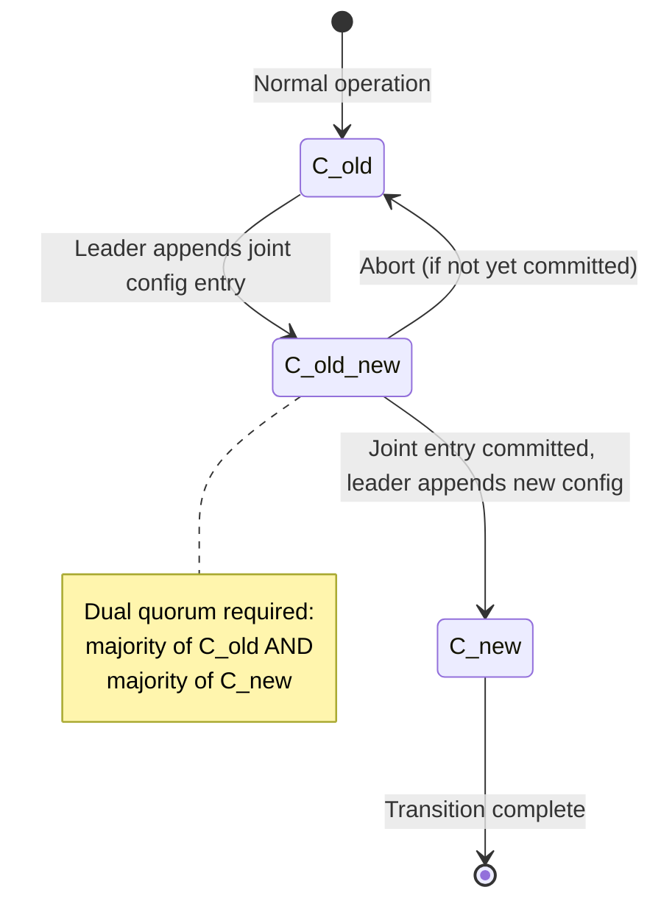
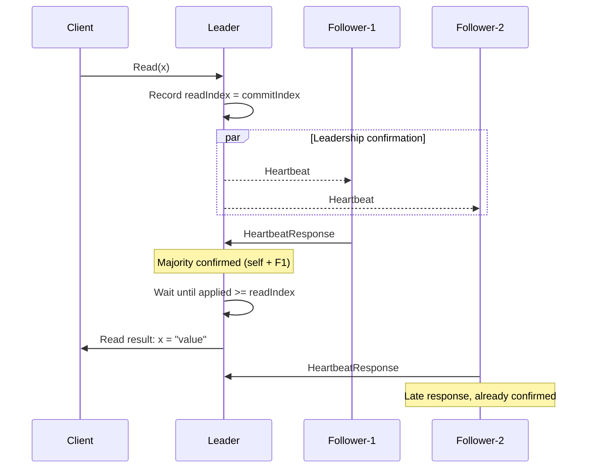

# Chapter 3: Advanced Raft Theory

*The basic Raft protocol (Chapter 2) handles elections, replication, and safety. But production systems encounter situations that the base protocol doesn't address well: partitioned nodes that inflate the cluster's term, unsafe membership changes, reads that return stale data, and the need for graceful leader retirement. This chapter covers the extensions that bridge the gap between Raft-the-paper and Raft-in-production.*

---

## Pre-Vote Protocol

### The Problem: Term Inflation from Partitioned Nodes

The basic Raft protocol has a subtle operational issue that becomes a real problem in production environments. Consider what happens when a single follower gets cut off from the rest of the cluster by a network partition:

```
┌─────────────┐      ╳ Partition ╳       ┌─────────────┐
│   Node A    │                          │   Node C    │
│ (Follower)  │◄─────────────────────────│  (Leader)   │
│   term = 5  │       Network OK         │   term = 5  │
└─────────────┘                          └─────────────┘
                                         ┌─────────────┐
                                         │   Node B    │
         ╳ Partition ╳                   │ (Follower)  │
                                         │   term = 5  │
┌─────────────┐                          └─────────────┘
│   Node D    │   ← Isolated! Cannot reach any peer
│ (Follower)  │
│   term = 5  │
└─────────────┘
```

Node D can't reach anyone. Its election timer fires. It starts an election, incrementing its term to 6. Nobody responds (because they can't reach Node D), so the election times out. Node D's timer fires again — term 7. Still no response. Term 8, 9, 10, ... By the time the partition heals, Node D is at term 47, but it has no log entries that the rest of the cluster doesn't already have.

Here's the problem: when Node D rejoins, **every message it sends carries term 47**. The rest of the cluster is still at term 5. When they receive Node D's messages, the Raft term rule (Chapter 2) forces them to immediately step up to term 47 and revert to Follower state. This means:

1. **The current leader (Node C) is deposed** — even though it was operating perfectly.
2. **All in-flight client requests are disrupted.**
3. **A new election is triggered at term 47** — and Node D can't even win it (its log is stale from being partitioned).

This phenomenon is called **term inflation**, and it's a serious operational problem. A single flaky network connection to one node can repeatedly disrupt an otherwise healthy cluster.

### The Solution: Two-Phase Elections

The pre-vote protocol was proposed by Diego Ongaro in §9.6 of his doctoral thesis (*"Consensus: Bridging Theory and Practice"*, Stanford University, 2014) as a direct fix for term inflation. The idea is elegant: before starting a real election that increments the term, a node first runs a **preliminary check** ("pre-vote") to see if it would even have a chance of winning.

```
Standard Raft:    Follower → Candidate(term+1) → may disrupt cluster

With Pre-Vote:    Follower → PreCandidate(same term) → got majority?
                                                            │
                                                     Yes ───┼──→ Candidate(term+1)
                                                     No  ───┼──→ stays Follower
```

In the pre-vote phase:

- The pre-candidate sends `RequestVote` RPCs with a special `isPreVote = true` flag, **at the next term** (current term + 1), but **does not actually increment its own term**.
- No `PersistHardState` effects are produced — the node's durable state is unchanged.
- Receiving nodes evaluate the vote request normally (checking log freshness) but **do not update their own term** in response.
- The pre-vote does not count as a "real" vote, so nodes can grant pre-votes even if they've already voted in the current term.

Only if a majority grants the pre-vote does the node proceed to a real election with term increment. If the node is partitioned and can't reach a majority, its term never changes — the cluster is protected from term inflation.

> **Note — Pre-Vote and Safety:** A common concern is whether pre-vote might break Raft's safety properties. It doesn't. Pre-vote only gates **entry** into a real election — once the real election starts, it proceeds identically to standard Raft with all the same safety guarantees. Pre-vote is a purely additive optimization; removing it gives you back standard Raft behavior with no safety regressions.

### When to Enable Pre-Vote

In production, **pre-vote should almost always be enabled**. The only case where you might disable it is in a testing environment where you want to exercise the raw election logic without the pre-vote layer. All major production Raft implementations — etcd/raft, CockroachDB, and TiKV — enable pre-vote by default.

## Leader Stickiness

### The Problem: Unnecessary Elections During Transient Delays

Even with pre-vote, there's a subtler source of disruptive elections. Imagine a perfectly healthy cluster where the leader's heartbeat arrives just a few milliseconds *after* a follower's election timer fires. The follower starts a (pre-vote) election, potentially disrupting the leader — all because of a minor timing race.

This is especially common under heavy load, when the leader might be busy processing many client requests and its heartbeat gets slightly delayed.

### The Solution: "Check Pulse" Before Voting

Leader stickiness (also called the **CheckQuorum** optimization) adds a simple check to the vote-granting logic:

```
Follower receives RequestVote (or pre-vote):
  if (I received a heartbeat from a valid leader within the last electionTimeout):
    reject the vote  — "I already have a working leader, no election needed"
  else:
    evaluate the vote normally
```

The intuition is straightforward: if the leader is alive and communicating, there's no reason to elect a new one. Only if the leader has actually stopped sending heartbeats (indicating a genuine failure) will followers grant votes.

> **Note — Leader Stickiness and Leader Transfer:** One edge case to handle: if a leadership transfer is in progress (the leader deliberately tells another node to start an election via `TimeoutNow`), the target node should be able to get votes even if followers recently heard from the current leader. Production implementations handle this by allowing `TimeoutNow`-triggered elections to bypass the leader stickiness check.

## Joint Consensus: Safe Membership Changes

### The Problem: The Membership Change Dilemma

In any long-running system, the cluster membership will change: you add nodes for capacity, remove decommissioned nodes, replace failed hardware, or resize the cluster for performance tuning. But changing membership in a consensus algorithm is **dangerous**, because there can be a moment when **two disjoint majorities** exist simultaneously.

Here's the specific danger:

```
Old config: {A, B, C}          → majority = 2 nodes
New config: {A, B, C, D, E}    → majority = 3 nodes

During transition, if:
  - {A, B} think old config is active (majority = 2/3 ✓) and elect a leader
  - {C, D, E} think new config is active (majority = 3/5 ✓) and elect a leader
→ TWO LEADERS! Split-brain!
```

The problem is that there's no single instant at which the entire cluster atomically switches from the old configuration to the new one. Different nodes learn about the configuration change at different times, and during this window, two independent majorities can form.

### The Solution: Joint Consensus — A Two-Phase Transition

The Raft paper (§6) describes **joint consensus** as the safe solution. The key idea is to introduce a transitional configuration (**C_old,new**) in which both the old and new configurations must agree for any decision to be made.

The transition goes through three phases:



In more detail:

### Walking Through the Mechanics

Let's trace through a concrete example — adding nodes D and E to a cluster of {A, B, C}:

1. **Leader (in old config {A, B, C}) appends a joint configuration entry** to its log: `C_old,new = old:{A,B,C}, new:{A,B,C,D,E}`.

2. **The joint entry is replicated like any other log entry**, but using the dual-quorum rule: it needs a majority of {A,B,C} (≥ 2) AND a majority of {A,B,C,D,E} (≥ 3) to be committed.

3. **Once C_old,new is committed**, the leader appends a second entry for the new configuration: `C_new = {A,B,C,D,E}`.

4. **Once C_new is committed**, the transition is complete. The old configuration is discarded, and the cluster operates under. the new five-node configuration.

### Safety Argument

Joint consensus is safe because at no point can two disjoint majorities independently form:

- **Before C_old,new is committed**: only C_old matters. Majorities are determined by the old config. No ambiguity.
- **While C_old,new is active**: any decision requires agreement from majorities of **both** configs. Since any two majorities of the same set overlap, and the joint requirement spans both sets, it's impossible for two independent quorums to form.
- **After C_new is committed**: any leader elected after this point must have the C_new entry (by the election restriction), so it uses C_new exclusively. Old configuration is irrelevant.

> **Note — Single-Server Changes:** The Raft paper also describes a simpler approach for adding or removing **one node at a time** (§4.3 of Ongaro's thesis). The insight is that adding or removing a single node can never create two disjoint majorities — just check the math. However, this approach can't safely handle adding or removing multiple nodes simultaneously, which is why joint consensus exists. In this library, we implement the general joint consensus approach, which handles any membership change.

### Aborting a Transition

What if the membership change goes wrong? Maybe the new nodes are unreachable, or an operator changes their mind. Joint consensus supports **safe abortion**: if the C_old,new entry hasn't been committed yet, it can be discarded, and the cluster reverts to C_old. If it has been committed, a new C_old entry can be appended to the log to "undo" the transition. In either case, safety is preserved.

## Linearizable Reads

### The Problem: Stale Reads from Deposed Leaders

In Chapter 2, we established that client writes go through the leader and are committed once replicated to a majority. But what about reads? A naive implementation might serve reads directly from the leader's state machine without going through the log. This is fast but **unsafe**:

```
Time 0: Leader A (term 5) serves read(x) → "5"        ← correct
Time 1: Network partition isolates Leader A
Time 2: Nodes B, C, D elect Leader B (term 6)
Time 3: Leader B commits write(x = "7")
Time 4: Client reads from Leader A → still returns "5" ← STALE!
```

Leader A doesn't know it's been deposed — it hasn't received any messages from the new leader, so its term is still 5 and it still thinks it's the leader. This violates **linearizability**, the gold standard for consistency: a read that happens after a write (in real time) should always reflect that write.

There are three approaches to solving this, ranging from most expensive to cheapest:

### Approach 1: Log Reads (Expensive but Simple)

Treat every read as a write: append a "read command" to the log, replicate it to a majority, and only serve the read after the entry is committed. This guarantees linearizability because the read goes through the same consensus mechanism as writes.

**Cost**: one full log replication round-trip per read. This is typically unacceptable for read-heavy workloads.

### Approach 2: ReadIndex (One RTT, No Clock Dependency)

The ReadIndex protocol avoids putting reads into the log while still guaranteeing linearizability. The steps are:

```
1. Client sends read(x) to the leader
2. Leader records its current commitIndex as the "readIndex"
3. Leader sends heartbeats to all followers (a lightweight round-trip)
4. If a majority responds → the leader is confirmed to still be the leader
5. Leader waits until its state machine has applied entries through readIndex
6. Leader reads from its state machine and returns the result
```

**Why this works**: Step 4 confirms that no new leader has been elected (because the responding majority would have rejected the heartbeat if they'd already voted for a different leader in a higher term). Step 5 ensures the read reflects all committed writes up to the point the read was initiated.

**Cost**: one heartbeat round-trip per read (or per batch of reads — you can batch multiple reads behind a single heartbeat confirmation).

The complete ReadIndex sequence:



> **Note — ReadIndex and Followers:** A variation of ReadIndex allows **followers** to serve linearizable reads. The follower asks the leader for the current commit index, the leader confirms its leadership via heartbeat, and then the follower waits until it has applied entries through that index before serving the read. This distributes read load across the cluster. etcd implements this as "serializable reads" at followers.

### Approach 3: Lease-Based Reads (Zero RTT, Requires Clock Assumptions)

If you're willing to assume that clocks on different nodes are **approximately synchronized** (bounded clock skew), you can eliminate the heartbeat round-trip entirely.

The idea: when the leader receives heartbeat acknowledgments from a majority, it knows that **no election can succeed for at least one election timeout period** (because the followers that acknowledged the heartbeat have reset their election timers). The leader can therefore claim a "leadership lease" and serve reads without further confirmation during the lease period.

```
1. Leader receives heartbeat ACKs from a majority at local time T
2. Leader calculates lease expiry = T + electionTimeout - maxClockSkew
3. During the lease period (now < lease expiry):
      → serve reads immediately from local state machine (zero RTT!)
4. After lease expires:
      → fall back to ReadIndex
```

**The catch**: this only works if the clock skew between nodes is bounded by `maxClockSkew`. If a follower's clock runs too fast and it starts an election before the leader's lease expires, a new leader could be elected while the old leader still thinks its lease is valid, leading to stale reads.

| Read Strategy | Latency | Safety Requirements | Used By |
|--------------|---------|-------------------|---------|
| **Log reads** | Full replication RTT | None | Conservative deployments |
| **ReadIndex** | One heartbeat RTT | None | etcd, most Raft implementations |
| **Lease-based** | Zero extra RTT | Bounded clock skew | CockroachDB, TiKV |

The lease timeline:

```mermaid
gantt
    title Leader Lease Timeline
    dateFormat X
    axisFormat %s

    section Leader
    heartbeat ACKs received     :milestone, 0, 0
    Lease valid (serve reads)   :active, 0, 8
    Lease expired (use ReadIndex) :crit, 8, 10

    section Clock Budget
    electionTimeout             :0, 10
    maxClockSkew margin         :8, 10
```



> **Note — Clock Skew in Practice:** In a well-configured data center with NTP, clock skew is typically under 10ms. With PTP (Precision Time Protocol) or dedicated time hardware (like Google's TrueTime), it can be under 1ms. For most deployments, lease-based reads with a conservative maxClockSkew setting are safe and provide a significant latency improvement for read-heavy workloads. However, if you're running on unreliable infrastructure (multi-cloud, edge computing), prefer ReadIndex.

## Leadership Transfer

### The Problem: Graceful Leader Retirement

In production systems, you often need to move leadership away from a specific node:

- **Rolling upgrades**: you want to upgrade the leader's software version without disrupting the cluster. Drain leadership first, upgrade the node, let it rejoin as a follower.
- **Load balancing**: one node might be overloaded because it's serving as leader for multiple Raft groups (in a multi-group setup). Transfer some groups' leadership to less-loaded nodes.
- **Planned maintenance**: a node's host machine is scheduled for hardware replacement.
- **Regionality**: move leadership closer to the majority of clients to reduce latency.

Without a transfer protocol, the operator's only option is to kill the leader process and wait for a new election — which causes a service disruption equal to the election timeout (150-300ms typically, plus the time to replicate any uncommitted entries).

### The Solution: The TimeoutNow Protocol

The leadership transfer protocol provides a **zero-downtime** handoff:

```
1. Admin requests: "transfer leadership to Node B"
2. Leader (Node A) stops accepting new client requests
3. Leader sends any remaining log entries to Node B
4. Leader waits until Node B's log is fully caught up (matchIndex == leader's log length)
5. Leader sends TimeoutNow to Node B
6. Node B immediately starts an election (skipping the randomized timeout AND pre-vote)
7. Node B wins (it has the most up-to-date log, and the old leader votes for it)
8. Node B becomes the new leader and starts accepting requests
```

The `TimeoutNow` message is a special directive that tells the target node: "start an election right now, don't wait for your election timer." This bypasses both the randomized timeout and the pre-vote check (since the transfer was initiated by the current leader, there's no need to check if an election would succeed — the leader has already ensured the target's log is caught up).

The total time for a leadership transfer is approximately one network round-trip — far faster than waiting for an election timeout after a crash.

> **Note — Safety During Transfer:** What if the leader crashes between steps 3 and 5? The transfer is safe regardless: if the leader crashes, a normal election will occur, and the target node (with its up-to-date log) is likely to win. If the TimeoutNow message is lost, the transfer simply doesn't happen, and the leader can retry. Leadership transfer is a best-effort optimization, not a safety-critical path.

## Log Compaction and Snapshots

### The Problem: Unbounded Log Growth

Under normal Raft operation, the log grows monotonically — entries are appended but never deleted. Even entries that have been committed and applied to the state machine remain in the log. Over time, this creates two problems:

1. **Disk usage**: the log consumes unbounded storage. A system processing 10,000 writes per second accumulates about 1 billion log entries per day.
2. **New node startup**: when a new node joins the cluster (or a crashed node restarts with an empty log), it must replay the entire log from entry 1 to reach the current state. For a log with billions of entries, this could take hours.

### The Solution: Periodic Snapshots

The solution is **log compaction via snapshots** (§7 of the Raft paper). Each node periodically takes a snapshot of its state machine at a particular log index, capturing the cumulative effect of all log entries up to that index. Once the snapshot is saved, the log entries through that index can be discarded.

```
Before compaction:
  [entry 1] [entry 2] [entry 3] [entry 4] [entry 5] [entry 6]
                                                       ↑ last applied

After snapshot at index 4:
  [SNAPSHOT: state machine state at index 4] [entry 5] [entry 6]
  Contains: lastIncludedIndex=4, lastIncludedTerm=1, state machine data
```

A snapshot must include:
- **State machine data**: the complete state of the application at the snapshot point (e.g., the full contents of a key-value store)
- **Last included index and term**: the index and term of the last log entry included in the snapshot, so that the snapshot can be "linked" to the remaining log entries
- **Cluster configuration**: the membership configuration at the snapshot point (important for membership changes)

### InstallSnapshot: Bringing Lagging Nodes Up to Date

When a follower falls so far behind that the leader has already discarded the entries it needs (because they've been compacted into a snapshot), the leader uses `InstallSnapshot` instead of `AppendEntries`:

```
Leader: "I need to send you entries starting from index 3..."
Leader: "Wait, I've already compacted entries 1-1000 into a snapshot."
Leader: → sends InstallSnapshot(lastIncludedIndex=1000, ..., data=<snapshot bytes>)
Follower: installs snapshot, replaces its state machine state
Leader: → resumes normal AppendEntries from index 1001
```

For large state machines, the snapshot data may be too large to fit in a single RPC. In such cases, the leader can send the snapshot in **chunks** (offset-based transfer), with the follower reassembling the chunks and applying the complete snapshot once all chunks arrive. The library supports this via the `PendingSnapshot` data structure (see Chapter 6).

> **Note — Snapshot triggering**: The Raft paper leaves the policy for when to take snapshots up to the implementation. Common strategies include:
> - **Size-based**: snapshot when the log exceeds a threshold size (e.g., 10,000 entries)
> - **Time-based**: snapshot at fixed intervals (e.g., every hour)
> - **Ratio-based**: snapshot when the log is N times larger than the last snapshot
>
> The library provides the `StateMachine.snapshot` SPI method for applications to generate their snapshot data; the triggering policy is left to the runtime implementation.

## Non-Voting Members: Learners and Witnesses

Not every node in a Raft cluster needs to be a full voting member. The concept of **non-voting members** with specialized roles is important for operational flexibility.

### Learner Nodes

A **learner** receives log entries from the leader (just like a voter) but does **not** vote in elections or count toward quorum calculations. Learners are useful for:

- **Catch-up before promotion**: when adding a new node, bring it in as a learner first. It replicates the full log without affecting cluster availability. Once it's caught up, promote it to voter. This avoids the dangerous window where a new voter that hasn't caught up yet reduces the cluster's effective availability (because it's counted toward quorum but can't actually contribute to it).

- **Read replicas**: learners can serve (slightly stale) reads without affecting write throughput, since adding learners doesn't change the quorum size.

- **Geo-replication**: place learner replicas in distant data centers for disaster recovery or regional read performance, without increasing write latency (since learners don't affect commit quorum).

### Witness Nodes

A **witness** is the opposite of a learner: it **votes** in elections but stores only minimal state (metadata, no full log replication). Witnesses serve as lightweight tie-breakers for even-sized clusters.

For example, a two-datacenter deployment might have 2 full voters in DC-1 and 2 full voters in DC-2, with a witness in DC-3. The witness ensures that elections can always form a majority (3/5) even if one datacenter is unreachable, without requiring a third datacenter to host a complete replica.

| Role | Votes in Elections? | Receives Full Log? | Runs State Machine? | Use Case |
|------|:------------------:|:-----------------:|:------------------:|----------|
| **Voter** | ✓ | ✓ | ✓ | Standard full replica |
| **Learner** | ✗ | ✓ | ✓ | Catch-up, read replicas, geo-replication |
| **Witness** | ✓ | ✗ (metadata only) | ✗ | Tie-breaking in even-sized clusters |

> **Note — etcd's Learner Implementation:** etcd popularized the learner concept in its Raft implementation. Before etcd 3.4, adding a new member to the cluster was risky because a slow new member could reduce availability. Since etcd 3.4, new members join as learners by default and must be explicitly promoted to voters after catching up. This pattern has been adopted by most production Raft implementations.

## Summary

| Extension | Problem it Solves | Mechanism | First Described In |
|-----------|------------------|-----------|-------------------|
| **Pre-Vote** | Term inflation from partitioned nodes | Two-phase election; pre-check before incrementing term | Ongaro thesis §9.6 |
| **Leader Stickiness** | Unnecessary elections during transient delays | Reject votes when a valid leader was recently heard from | Ongaro thesis §9.6 |
| **Joint Consensus** | Unsafe membership changes | Dual-quorum transition through C_old,new | Raft paper §6 |
| **ReadIndex** | Stale reads from deposed leaders | Heartbeat confirmation before serving reads | Ongaro thesis §6.4 |
| **Lease Reads** | Read latency | Time-bounded leadership; zero-RTT reads | Ongaro thesis §6.4 |
| **Leadership Transfer** | Graceful leader retirement | TimeoutNow message; zero-downtime handoff | Ongaro thesis §3.10 |
| **Snapshots** | Unbounded log growth | State machine checkpoint; discard compacted entries | Raft paper §7 |
| **Learners/Witnesses** | Operational flexibility | Non-voting replication / voting-only lightweight nodes | etcd 3.4+, Ongaro thesis |

---

*Next: [Chapter 4 — Safety Proofs, Implemented](04-safety-proofs-implemented.md) maps each of Raft's five safety properties to the exact lines of library code that enforce them, with formal proof sketches, test cases, and TLA+ cross-references.*
