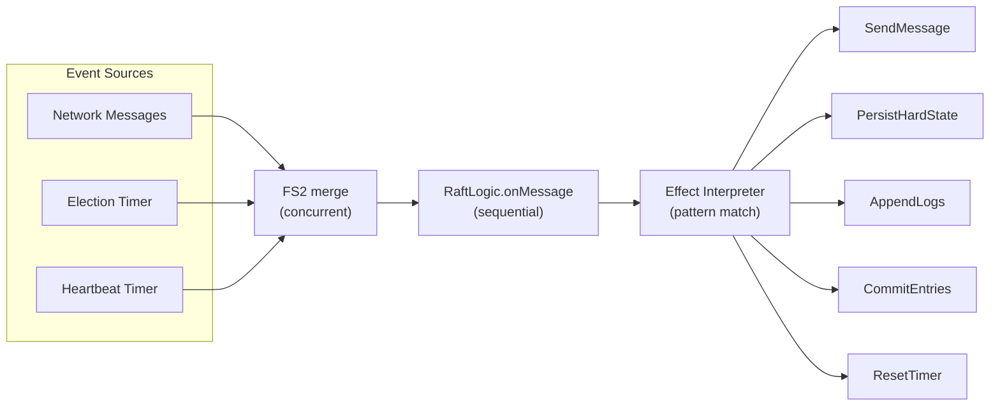

# Chapter 8: Getting Started

*This chapter takes you from zero to a working Raft election in under 50 lines of code. No networking, no threads, no server processes — just pure function calls. By the end, you'll have built a complete event loop and understand how to test any Raft scenario.*

---

## Setup

Add the library to your `build.sbt`:

```scala
val scala3Version = "3.3.7"

lazy val root = project
  .in(file("."))
  .settings(
    scalaVersion := scala3Version,
    libraryDependencies ++= Seq(
      "org.typelevel" %% "cats-effect" % "3.6.3",
      "co.fs2"        %% "fs2-core"    % "3.12.2"
    )
  )
```

The core protocol logic — `RaftLogic`, `NodeState`, `RaftMessage`, `Effect` — has **zero runtime dependencies**. It's pure Scala 3 code with no imports from Cats Effect, FS2, or any other library. You only need Cats Effect and FS2 if you use the SPI implementations (`InMemTransport`, `InMemLogStore`, etc.) and the `RaftNode` runtime. This means you can use the protocol logic in any Scala 3 environment, including Scala.js.

## Your First Election: A Step-by-Step Walkthrough

Let's elect a leader in a 3-node cluster using nothing but function calls. This is the "hello world" of Raft — and because the logic is pure, you can run this in a worksheet, REPL, or test class with no setup whatsoever.

### Step 1: Define the Cluster

```scala
import raft.state.*
import raft.state.NodeState.*
import raft.message.RaftMessage.*
import raft.logic.RaftLogic
import raft.effect.Effect.*

val n1 = NodeId("node-1")
val n2 = NodeId("node-2")
val n3 = NodeId("node-3")

// Disable pre-vote for this demo so we can see the raw election mechanics
val config = RaftConfig(localId = n1, preVoteEnabled = false)

// All three nodes start as Followers at term 0
var state1: NodeState = Follower(term = 0, votedFor = None, leaderId = None)
var state2: NodeState = Follower(term = 0, votedFor = None, leaderId = None)
var state3: NodeState = Follower(term = 0, votedFor = None, leaderId = None)
```

At this point, we have three nodes. None of them know about the others — there's no network, no discovery mechanism. The cluster topology is implied by the `clusterSize` parameter in the function calls below.

### Step 2: Fire the Election Timeout

In a real deployment, the election timer fires after a random delay. Here we simulate it by sending `ElectionTimeout` directly:

```scala
val election = RaftLogic.onMessage(state1, ElectionTimeout, config, 0, 0, 3)

state1 = election.state
// state1 → Candidate(term = 1, votesReceived = {node-1})
```

Node-1 transitions to `Candidate`, increments its term to 1, and votes for itself. Now look at the effects the function produced — these are instructions for the runtime:

```scala
election.effects.foreach(println)
// PersistHardState(1, Some(node-1))          ← persist the new term and self-vote
// Broadcast(RequestVoteRequest(term=1, ...)) ← ask all peers for their votes
// ResetElectionTimer                         ← restart the timer for split-vote retry
```

Three things happened, all expressed as data. No network calls were made. No disk was written to. The effects are just descriptions — plain Scala objects waiting to be executed.

### Step 3: Followers Receive the Vote Request

Extract the vote request from the effects, and feed it into node-2's state machine:

```scala
val voteReq = election.effects.collectFirst {
  case Broadcast(req: RequestVoteRequest) => req
}.get

val t2 = RaftLogic.onMessage(state2, voteReq, RaftConfig(n2), 0, 0, 3)
state2 = t2.state   // Follower(term = 1, votedFor = Some(node-1))

val vote2 = t2.effects.collectFirst {
  case SendMessage(_, r: RequestVoteResponse) => r
}.get
// vote2.voteGranted == true
```

Node-2 evaluates the vote request: "Is the candidate's term at least as large as mine? Is the candidate's log at least as up-to-date as mine? Have I already voted in this term?" All checks pass, so node-2 grants its vote.

Notice that node-2 is now a follower at term 1 with `votedFor = Some(node-1)`. Its hard state has changed, and the effects include `PersistHardState` — if this were a real system, the runtime would fsync this to disk before sending the vote response.

### Step 4: Win the Election

Feed the vote response back to node-1. Since we have a 3-node cluster and node-1 already has its own vote, this second vote gives it a majority (2/3):

```scala
val afterVote = RaftLogic.onVoteResponse(
  state1.asInstanceOf[Candidate], n2, vote2, config, 3
)

state1 = afterVote.state
// state1 → Leader(term = 1)

afterVote.effects.contains(BecomeLeader)
// true
```

That's it. **A complete Raft leader election in 15 lines of pure Scala.** No mocks, no network, no concurrency, fully deterministic. Every call is a pure function — same input, same output, every time.

> **Note — Why disable pre-vote for the demo?** With pre-vote enabled (the default), the election would take two rounds: a pre-vote phase (to check electability) followed by the real vote. The mechanics are identical — you just process two rounds of `RequestVote`/`RequestVoteResponse` instead of one. We disabled it here to keep the walkthrough concise. In production, always keep pre-vote enabled.

## The Event Loop: From Demo to Production

The step-by-step walkthrough above manually fed events and collected effects. A real application automates this with an **event loop** — a continuous cycle that receives events (from the network and timers), processes them through `RaftLogic.onMessage`, and executes the resulting effects:



```scala
import cats.effect.IO
import cats.syntax.all.*

def eventLoop(
  stateRef: Ref[IO, NodeState],
  config: RaftConfig,
  transport: RaftTransport[IO],
  logStore: LogStore[IO],
  stableStore: StableStore[IO],
  timerService: TimerService[IO]
): IO[Unit] =
  // Merge all event sources into a single stream
  val events: Stream[IO, RaftMessage] =
    transport.receive.map(_._2)                             // messages from peers
      .merge(timerService.electionTimeouts.as(ElectionTimeout))   // election timer
      .merge(timerService.heartbeatTicks.as(HeartbeatTimeout))    // heartbeat timer

  // Process each event through the pure logic
  events.evalMap { msg =>
    for
      state        <- stateRef.get
      lastIdx      <- logStore.lastIndex
      lastTerm     <- logStore.termAt(lastIdx).map(_.getOrElse(0L))
      clusterSize  =  3  // from your cluster config

      transition   =  RaftLogic.onMessage(
                         state, msg, config, lastIdx, lastTerm, clusterSize
                       )

      _            <- stateRef.set(transition.state)
      _            <- executeEffects(
                         transition.effects, transport, logStore,
                         stableStore, timerService
                       )
    yield ()
  }.compile.drain
```

The event sources are merged using FS2's `merge`, which interleaves items from multiple streams concurrently. The `evalMap` processes each event sequentially — this is important because Raft transitions must be applied in order (you can't process two events concurrently on the same node).

### The Effect Interpreter

The effect interpreter is a pattern match over the `Effect` ADT. Here's a complete implementation:

```scala
def executeEffects(
  effects: List[Effect],
  transport: RaftTransport[IO],
  logStore: LogStore[IO],
  stableStore: StableStore[IO],
  timerService: TimerService[IO]
): IO[Unit] =
  effects.traverse_ {
    case Broadcast(msg)            => transport.broadcast(msg)
    case SendMessage(to, msg)      => transport.send(to, msg)
    case PersistHardState(term, v) => stableStore.setCurrentTerm(term) *> stableStore.setVotedFor(v)
    case AppendLogs(entries)       => logStore.append(entries)
    case TruncateLog(fromIdx)      => logStore.truncateFrom(fromIdx)
    case CommitEntries(upTo)       => IO.println(s"Committed up to index $upTo")
    case ResetElectionTimer        => timerService.resetElectionTimer
    case ResetHeartbeatTimer       => timerService.resetHeartbeatTimer
    case BecomeLeader              => IO.println("I am the leader!")
    case _                         => IO.unit
  }
```

> **Note — Effect ordering:** The `traverse_` function processes effects in order. This is important because the protocol logic emits `PersistHardState` effects before `Broadcast` and `SendMessage` effects. Executing them in order ensures that the node persists its state before sending messages — which is required for crash safety (see Chapter 7).

## Running the Examples

The library ships with 11 runnable examples that cover everything from basic protocol mechanics to full distributed applications. Each example is a standalone `main` class you can run with sbt:

```bash
# Protocol fundamentals
sbt "runMain examples.protocol.PreVoteExample"
sbt "runMain examples.protocol.LogMatchingExample"
sbt "runMain examples.protocol.CommitTrackingExample"
sbt "runMain examples.protocol.TimerServiceExample"

# Cluster simulation (3-node in-memory cluster with real message passing)
sbt "runMain examples.cluster.ThreeNodeClusterExample"

# Application case studies
sbt "runMain examples.kvstore.KVStoreExample"
sbt "runMain examples.lock.DistributedLockExample"
sbt "runMain examples.counter.CounterWithCodecExample"
sbt "runMain examples.distributed.DistributedCounterExample"
sbt "runMain examples.distributed.RaftTransactionExample"
sbt "runMain examples.distributed.DistributedTransactionExample"
```

Each example is self-contained and heavily commented. Start with `PreVoteExample` to see how Pre-Vote gates election entry, then move to `ThreeNodeClusterExample` to see a complete cluster simulation, and finally explore the application examples.

## Testing Your Code

The pure design makes testing truly effortless. Here are two examples that demonstrate the pattern:

```scala
import org.scalatest.flatspec.AnyFlatSpec
import org.scalatest.matchers.should.Matchers

class MyRaftSpec extends AnyFlatSpec with Matchers:

  "A Follower" should "become Candidate on election timeout" in {
    val follower = Follower(term = 0, votedFor = None, leaderId = None)
    val config = RaftConfig(NodeId("n1"), preVoteEnabled = false)

    val trans = RaftLogic.onMessage(follower, ElectionTimeout, config, 0, 0, 3)

    trans.state shouldBe a[Candidate]
    trans.state.term shouldBe 1
    trans.effects should contain (PersistHardState(1, Some(NodeId("n1"))))
  }

  "A Leader" should "step down when receiving a higher term" in {
    val leader = Leader(term = 5)
    val higherTermMsg = AppendEntriesRequest(
      term = 10, leaderId = NodeId("n2"),
      prevLogIndex = 0, prevLogTerm = 0,
      entries = Seq.empty, leaderCommit = 0
    )

    val trans = RaftLogic.onMessage(leader, higherTermMsg,
      RaftConfig(NodeId("n1")), 0, 0, 3)

    trans.state shouldBe a[Follower]
    trans.state.term shouldBe 10
  }

  "CommitEntries" should "be emitted when commit index advances" in {
    // You can test specific protocol behaviors by constructing
    // precise states and messages — no cluster setup required
  }
```

Run the full test suite:

```bash
sbt test                            # all 333 tests
sbt "testOnly *ChaosScenarioSpec"   # adversarial network/timing scenarios
sbt "testOnly *SafetyPropertySpec"  # property-based safety invariants
```

The test suite runs in seconds, not minutes, because there are no real network connections or timer waits. This is the payoff of the pure function architecture.

## Summary

| What You Built | What You Learned |
|---------------|-----------------|
| **Election walkthrough** | 15 lines of pure function calls elect a leader with no infrastructure |
| **Effect interpreter** | Your runtime executes effect descriptors — you control the "how" |
| **Event loop** | Merge `transport.receive` + timer streams into a single processing pipeline |
| **Tests** | Call functions, check outputs — no mocks, no waits, deterministic results |

---

*Next: [Chapter 9 — Log Replication in Practice](09-log-replication-practice.md) covers how data actually flows through the cluster — creating entries, handling conflicts, advancing the commit index, and tuning throughput with batching and pipelining.*
