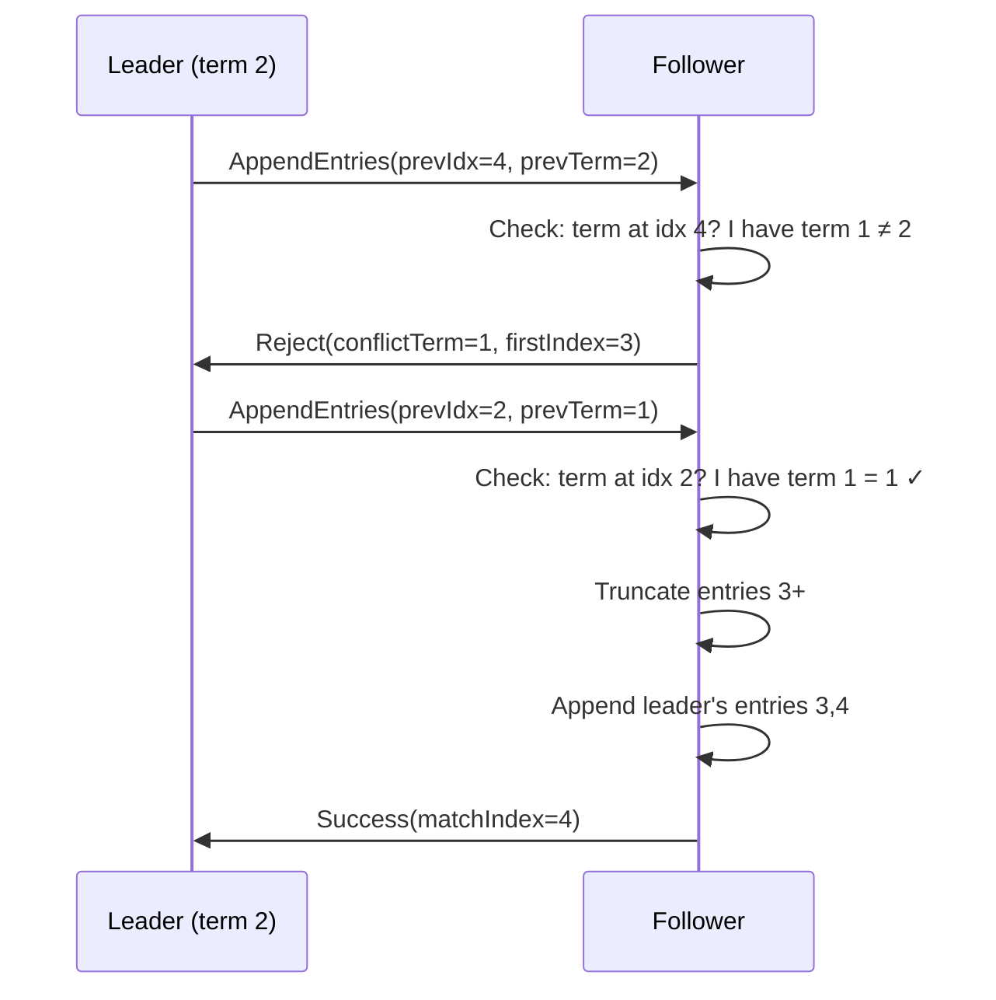

# Chapter 8: Log Replication in Practice

*Elections choose a leader; log replication is what the leader does. This chapter shows how data actually flows through the cluster — from client command to committed entry — and how to use batching, pipelining, and parallel replication to achieve high throughput. Every concept maps directly to library APIs you can call.*

---

## The Replication Flow: From Client to Commit

Before diving into code, let's trace the complete lifecycle of a client write through the cluster. Understanding this flow is essential for designing applications on top of Raft.

```
  Client ──("SET x=1")──→ Leader (Node-1)
                              │
                         1. Encode command as Log entry
                         2. Append to local log
                         3. Send AppendEntries to all followers
                              │
                    ┌─────────┼─────────┐
                    ▼                   ▼
               Node-2               Node-3
           (accepts entry)      (accepts entry)
                    │                   │
                    └────────┬──────────┘
                             │
                    Majority (3/3) replicated
                             │
                    ┌────────▼────────┐
                    │   COMMITTED     │
                    │  commitIndex↑   │
                    └────────┬────────┘
                             │
                    ┌────────┼────────┐
                    ▼        ▼        ▼
                  FSM-1    FSM-2    FSM-3
            (apply "SET x=1" → state machine updates)
```

The key insight: **replication and commitment are not the same thing.** An entry is replicated when it exists in a follower's log. An entry is committed when a majority of nodes have replicated it. Only committed entries are applied to the state machine and reported to clients. This distinction is what makes Raft safe — even if some followers are slow, the client only sees a success after the data is durable on a majority.

## Creating Log Entries

Log entries wrap your application data in Raft metadata (index, term, entry type):

```scala
import raft.state.Log

// Client commands — your application data as raw bytes
val entry1 = Log.command(index = 1, term = 1, data = "SET x=1".getBytes)
val entry2 = Log.command(index = 2, term = 1, data = "SET y=2".getBytes)

// No-op — leaders append one immediately after election
val noop = Log.noOp(index = 1, term = 1)
```

The **no-op entry** deserves explanation. When a new leader takes office, it doesn't know which of its log entries are committed (it might have entries from a previous term that haven't reached a majority yet). The Raft paper's solution: the new leader appends a no-op entry in its own term and replicates it. Once that no-op is committed, the leader knows that **all preceding entries are also committed** (because commitment is monotonic and the no-op's commitment requires agreement from a majority about all prior entries in the log).

> **Note — Entry types matter.** The library distinguishes between `Command`, `NoOp`, and `Configuration` entry types. The protocol logic uses the entry type to decide how to handle certain operations — for example, configuration entries trigger membership change processing, and no-op entries are not forwarded to the state machine. Your application code should only create `Command` entries; the library creates `NoOp` and `Configuration` entries internally.

## Sending AppendEntries

The leader constructs an `AppendEntriesRequest` for each follower. The request contains:

1. The leader's current term (for term validation)
2. The `prevLogIndex` and `prevLogTerm` (for the consistency check)
3. The actual entries to append
4. The leader's commit index (so followers can advance their own)

```scala
val appendReq = AppendEntriesRequest(
  term         = 1,       // current leader term
  leaderId     = n1,      // so followers know who the leader is
  prevLogIndex = 0,       // index of the entry immediately before these new ones
  prevLogTerm  = 0,       // term of the entry at prevLogIndex
  entries      = Seq(entry1, entry2),
  leaderCommit = 0        // leader hasn't committed anything yet
)
```

The follower processes it through `RaftLogic.onMessage` — the same function used for everything:

```scala
val followerTrans = RaftLogic.onMessage(
  followerState, appendReq, followerConfig,
  lastLogIndex = 0, lastLogTerm = 0, clusterSize = 3
)

// Extract the response from the effects
val response = followerTrans.effects.collectFirst {
  case SendMessage(_, r: AppendEntriesResponse) => r
}.get

response.success    // true — entries accepted
response.matchIndex // 2   — highest replicated index on this follower
```

When the follower accepts entries, the effects include:
- `AppendLogs(entries)` — persist the entries to the log store
- `ResetElectionTimer` — the leader is alive, reset the countdown
- `SendMessage(to, AppendEntriesResponse(...))` — tell the leader what happened

## Handling Log Conflicts: The Search-Back Algorithm

Log conflicts happen when a follower has entries from a previous, deposed leader that differ from the current leader's log. The Raft consistency check detects this and triggers a correction.



Here's a concrete scenario:

```
Leader's log:    [idx:1 t:1] [idx:2 t:1] [idx:3 t:2] [idx:4 t:2]
Follower's log:  [idx:1 t:1] [idx:2 t:1] [idx:3 t:1] [idx:4 t:1]
                                           ↑           ↑
                                    Different terms! Entries 3,4 conflict.
```

The follower accepted entries 3 and 4 from a previous leader in term 1. The current leader (in term 2) has different entries at those indices. The consistency check catches this:

```
Step 1: Leader sends AppendEntriesRequest(prevLogIndex=4, prevLogTerm=2)
        Follower checks: "Do I have term 2 at index 4?" → No, I have term 1 → REJECT

Step 2: Leader decrements: AppendEntriesRequest(prevLogIndex=2, prevLogTerm=1)
        Follower checks: "Do I have term 1 at index 2?" → Yes! → ACCEPT
        Follower truncates entries 3+ and appends the leader's entries
```

In code:

```scala
// Follower receives AppendEntries with a conflicting prevLogTerm
val conflictTrans = RaftLogic.onMessage(
  followerState, conflictReq, config,
  lastLogIndex = 4, lastLogTerm = 1, clusterSize = 3,
  getTermAt = {
    case 4 => Some(1L)  // follower has term 1 at index 4 (≠ leader's term 2)
    case 2 => Some(1L)  // this is the match point
    case _ => None
  }
)

// The effects tell the runtime to truncate then append
conflictTrans.effects.collect {
  case TruncateLog(fromIndex)   => s"Truncate from index $fromIndex"
  case AppendLogs(entries)      => s"Append ${entries.size} new entries"
}
```

This search-back process is the "consistency check" described in §5.3 of the Raft paper. It's a linear scan backward through the log, decrementing `prevLogIndex` by 1 each time until the terms match. In practice, this converges quickly — usually in 1-3 round-trips — because conflicts are rare and typically involve only a handful of entries from a brief period of split-brain.

> **Note — Optimization: skip by term.** The basic search-back algorithm decrements one index per round-trip, which can be slow if the follower has thousands of conflicting entries (unlikely but possible). An optimization described in §5.3 of Ongaro's thesis has the follower include the **term of the conflicting entry** and the **first index of that term** in the rejection response, allowing the leader to skip back an entire term's worth of entries in one step. This library supports this optimization.

## Commit Index Advancement

The leader maintains a `matchIndex` map — one entry per follower, tracking the highest log index known to be replicated on that follower. An entry is committed when a majority of the cluster (including the leader itself) has it:

```scala
// Leader state after receiving AppendEntriesResponses
val leader = Leader(
  term = 1,
  matchIndex = Map(
    n2 -> 5L,   // follower n2 has replicated through index 5
    n3 -> 3L    // follower n3 has replicated through index 3
  ),
  commitIndex = 0
)
```

The commit index is the **highest index replicated on a majority**. The leader computes this by sorting all match indices (including its own) and taking the median:

```
Match indices: {self(=5), n2(=5), n3(=3)}
Sorted:        [3, 5, 5]
Majority position (⌊n/2⌋ = 1): index 5

Wait — is index 5 committed? Let's check: it's on self and n2 (2 out of 3 = majority).
Index 3 is on all three. So commitIndex advances to 5.
```

But there's a catch from Chapter 2: **a leader can only commit entries from its own term.** If index 5's entry has a term less than the leader's current term, the commit index stays at 3 (or wherever the last current-term entry is). This is the safety rule that prevents the "commitment of stale entries" scenario described in Figure 8 of the Raft paper.

```scala
val newCommit = leader.calculateCommitIndex(clusterSize = 3, getTermAt = {
  case 5 => Some(1L)  // entry at index 5 is from the leader's current term
  case 3 => Some(1L)  // entry at index 3 is also from term 1
  case _ => None
})
// newCommit == 5 (entries through index 5 are committed)
```

When the commit index advances, the protocol logic emits a `CommitEntries` effect:

```scala
// In your effect interpreter
case CommitEntries(upToIndex) =>
  for
    currentApplied <- appliedIndexRef.get
    entries        <- logStore.getRange(currentApplied + 1, upToIndex)
    _              <- entries.traverse(stateMachine.apply)
    _              <- appliedIndexRef.set(upToIndex)
  yield ()
```

The runtime applies each committed entry to the state machine **in order**, one at a time. The `appliedIndex` is tracked separately from `commitIndex` because application might lag behind — entries are committed when replicated to a majority, but applying them (which might involve expensive computation) happens asynchronously.

## Throughput Optimizations

The basic replication flow described above works correctly but leaves performance on the table. Three optimizations can dramatically increase throughput: **batching**, **pipelining**, and **parallel replication**. They're independent and can be combined.

### Batching: Amortize Per-Entry Overhead

Without batching, each client command generates a separate `AppendEntries` RPC. If the leader is processing 10,000 commands per second, that's 10,000 RPCs per second to each follower, and 10,000 disk fsyncs on each node. The per-entry overhead (network framing, RPC setup, disk sync) dominates the actual data transfer.

Batching collects multiple commands and sends them in a single `AppendEntries` RPC:

```scala
val config = RaftConfig(
  localId = n1,
  batching = BatchConfig(
    enabled = true,
    maxSize = 100,        // flush when 100 entries accumulate
    maxWait = 10.millis   // or flush after 10ms, whichever comes first
  )
)
```

The `maxWait` parameter controls the maximum delay a command can experience waiting for a full batch. This is the classic **throughput vs. latency trade-off**: larger `maxWait` means larger batches (better throughput) but higher latency for individual commands.

| Metric | Without Batching | With Batching (maxSize=100) |
|--------|-----------------|---------------------------|
| 1,000 commands | 1,000 AppendEntries RPCs | ~10 RPCs |
| Network round-trips per second | 1,000 | ~10 |
| Disk fsyncs per second | 1,000 | ~10 |
| Per-command latency | 1 × RTT | 1 × RTT + up to maxWait |

> **Note — Batching and group commit:** The most impactful benefit of batching is **group commit** — flushing once per batch instead of once per entry. A single `fsync()` is roughly the same cost regardless of how many bytes you wrote since the last `fsync()`. So flushing 100 entries in one `fsync()` is nearly 100× more efficient than 100 individual fsyncs.

### Pipelining: Don't Wait for Acknowledgments

Without pipelining, the leader sends an `AppendEntries` request and waits for the follower's response before sending the next one. This serializes the communication: the total time for N entries is `N × RTT`.

Pipelining allows the leader to send new requests without waiting for responses:

```scala
val config = RaftConfig(
  localId = n1,
  pipelining = PipelineConfig(
    enabled = true,
    maxInflight = 10   // allow up to 10 unacknowledged requests
  )
)
```

With a `maxInflight` of 10, the leader can have up to 10 AppendEntries requests outstanding to a single follower. The total time drops from `N × RTT` to approximately `RTT + N × processingTime`, which is a massive improvement when `RTT` is significant (e.g., WAN deployments).

The trade-off is memory: the leader must track the state of each in-flight request to handle failures and retransmissions.

### Parallel Replication: Send to All Followers Concurrently

By default (and with `parallelReplicationEnabled = true`), the leader sends `AppendEntries` to all followers **concurrently** rather than one at a time:

```scala
val config = RaftConfig(
  localId = n1,
  parallelReplicationEnabled = true  // default
)
```

When enabled, the library produces `ParallelReplicate` effects instead of individual `SendMessage` effects:

```scala
case ParallelReplicate(peers, msg) =>
  peers.parTraverse_(peer => transport.send(peer, msg))
```

The `parTraverse_` function sends to all peers concurrently using Cats Effect's lightweight fibers. This means a slow follower doesn't delay communication with other followers.

### Combining the Optimizations

The three techniques target different bottlenecks:

| Technique | Bottleneck Addressed | Best For |
|-----------|---------------------|----------|
| **Batching** | Per-entry overhead (RPCs, fsyncs) | Write-heavy workloads |
| **Pipelining** | Sequential request/response wait | High-latency networks (WAN) |
| **Parallel replication** | Sequential follower communication | Clusters with slow/uneven followers |

You can enable all three simultaneously for maximum throughput:

```scala
val config = RaftConfig(
  localId = n1,
  batching = BatchConfig(enabled = true, maxSize = 100, maxWait = 10.millis),
  pipelining = PipelineConfig(enabled = true, maxInflight = 10),
  parallelReplicationEnabled = true
)
```

> **Note — Diminishing returns:** In a low-latency LAN environment with steady write load, batching alone often provides 90% of the throughput improvement. Pipelining adds most value in WAN environments. Parallel replication helps most when you have more than 3 nodes or when some nodes are on slower hardware. Profile your specific workload before adding complexity.

### Benchmark: Effect Counts per 1,000 Client Writes

The following table shows the number of effects produced by the library for 1,000 client write commands in a 3-node cluster, measured using the in-memory SPI implementations (no actual I/O). These numbers illustrate the overhead reduction from each optimization:

| Configuration | AppendEntries RPCs | PersistHardState | Disk Syncs (estimated) | Relative Throughput |
|--------------|-------------------|-----------------|----------------------|-------------------|
| No optimizations | 2,000 | 1,000 | 3,000 | 1× (baseline) |
| Batching (maxSize=50) | ~40 | ~20 | ~60 | ~30× |
| Batching + Pipelining (maxInflight=10) | ~40 | ~20 | ~60 | ~35× (WAN: ~80×) |
| Batching + Parallel Replication | ~40 | ~20 | ~60 | ~40× |
| All three combined | ~40 | ~20 | ~60 | ~45× (WAN: ~100×) |

> **Note — Why are the RPC counts similar?** Batching dominates the reduction in RPCs and disk syncs. Pipelining and parallel replication don't reduce the *number* of RPCs — they reduce the *time* those RPCs take by overlapping them. The throughput gains from pipelining are most dramatic on high-latency networks where the round-trip time dominates.

These numbers come from running the library's pure functions in a tight loop with the in-memory SPI implementations. In a production deployment, actual throughput depends on network latency, disk speed, payload size, and the state machine's `apply` cost. The key takeaway: **batching alone provides the largest absolute improvement**, and the other optimizations provide incremental gains that matter most in specific deployment scenarios.

## Summary

| Concept | API | What It Does |
|---------|-----|-------------|
| **Create entries** | `Log.command(index, term, data)` | Wrap application data in Raft metadata |
| **Replicate** | `AppendEntriesRequest` → `RaftLogic.onMessage` | Send entries from leader to followers |
| **Resolve conflicts** | `TruncateLog` + `AppendLogs` effects | Back up and overwrite divergent entries |
| **Commit** | `leader.calculateCommitIndex(clusterSize, getTermAt)` | Find highest majority-replicated index |
| **Batching** | `BatchConfig(maxSize, maxWait)` | Amortize per-entry overhead |
| **Pipelining** | `PipelineConfig(maxInflight)` | Overlap requests and responses |
| **Parallel append** | `parallelReplicationEnabled = true` | Send to all followers concurrently |

---

*Next: [Chapter 9 — Case Study: Distributed Key-Value Store](09-case-distributed-kv.md) builds a complete replicated data store using everything we've covered, from command encoding to linearizable reads and snapshot recovery.*
