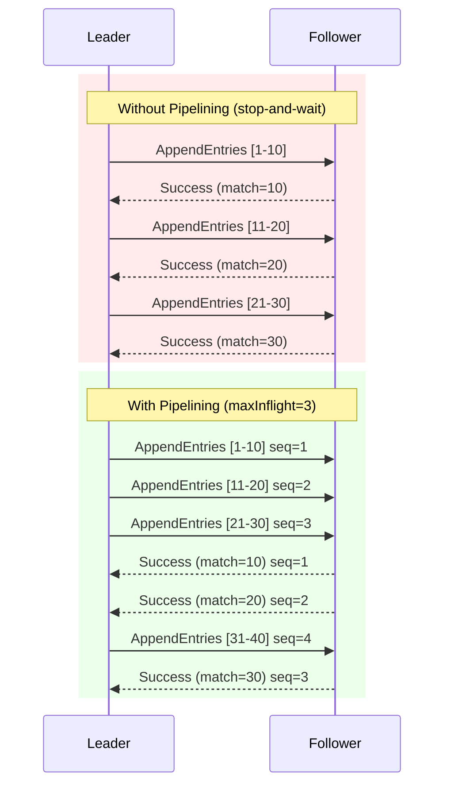
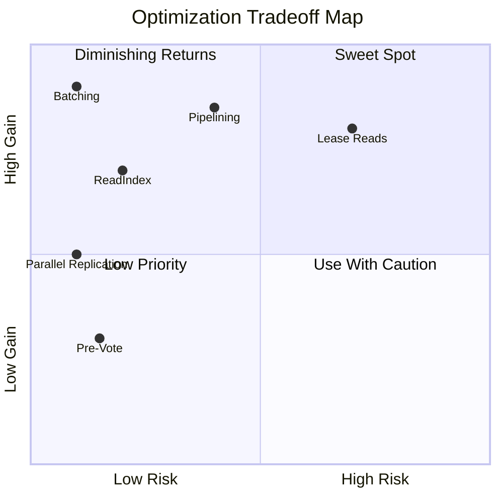

# Chapter 10: Performance vs. Safety — The Optimization Tradeoffs

*The Raft paper was designed for correctness, not throughput. Every production Raft deployment adds optimizations that aren't in the original paper — and every optimization introduces a tension between performance and safety. This chapter maps each optimization to its theoretical justification, explains exactly what safety guarantees it preserves or weakens, and shows how to configure them in the library.*

---

## The Fundamental Tension

Raft's baseline protocol makes conservative choices at every step:

- **Stop-and-wait replication**: the leader sends `AppendEntries` to one follower, waits for the response, then sends to the next.
- **Per-entry fsync**: every log entry is fsynced to disk before acknowledging.
- **Leader-only reads**: every read goes through the leader's log as a write operation.
- **Sequential heartbeats**: heartbeats are sent one follower at a time.

These choices guarantee safety but produce dismal throughput — often under 1,000 writes/second on modern hardware. Production systems like etcd, CockroachDB, and TiKV achieve 10,000–100,000+ writes/second by relaxing these constraints. The art is knowing *which* constraints can be relaxed without breaking Raft's safety properties.

```
Performance ←──────────────── Spectrum ──────────────────→ Safety

High throughput                                    Strict correctness
Low latency                                        Crash recovery
  ▲                                                      ▲
  │                                                      │
  Batching                                     Per-entry fsync
  Pipelining                               Stop-and-wait replication
  Lease reads                               ReadIndex with heartbeat
  Parallel replication                       Sequential replication
```

---

## Optimization 1: Batching — Amortizing fsync

### The Problem

Every individual `fsync()` call costs 1–10ms on an SSD, 5–15ms on a spinning disk. If the leader fsyncs after every log entry, throughput is capped at roughly `1 / fsync_latency` — about 100–1,000 entries/second.

### The Optimization

Instead of appending and fsyncing each entry individually, the leader **buffers** incoming commands and flushes them as a single batch:

```scala
val config = RaftConfig(
  localId = nodeId,
  batching = BatchConfig(
    enabled = true,
    maxSize = 100,      // flush after 100 entries
    maxWait = 10.millis  // or after 10ms, whichever comes first
  )
)
```

When batching is enabled, the library produces `BatchAppend` effects instead of individual `AppendLogs`:

```scala
// Without batching: one effect per entry
List(AppendLogs(Seq(entry1)), AppendLogs(Seq(entry2)), AppendLogs(Seq(entry3)))

// With batching: one effect for the batch
List(BatchAppend(Seq(entry1, entry2, entry3), batchId = "batch-42"))
```

The runtime's effect interpreter calls `fsync()` once for the entire batch — amortizing the cost across all entries.

### Safety Analysis

| Property | Preserved? | Why |
|----------|-----------|-----|
| Election Safety | ✅ Yes | Batching doesn't affect vote counting |
| Leader Append-Only | ✅ Yes | Batch entries are still only appended |
| Log Matching | ✅ Yes | Batch entries maintain `(index, term)` uniqueness |
| Leader Completeness | ✅ Yes | Batched entries are replicated before commit |
| State Machine Safety | ✅ Yes | Entries are committed only after majority replication |

**Batching is fully safe.** It changes *when* entries are fsynced, not *whether* they are fsynced. Every entry in the batch is durable before the leader considers it replicated. The only tradeoff is **latency** — entries may wait up to `maxWait` before being flushed, adding a small delay to individual writes.

> [!TIP]
> **Tuning guide**: Set `maxWait` based on your latency SLA. For interactive workloads (web requests), 5–10ms is reasonable. For data pipelines, 50–100ms with larger batch sizes maximizes throughput.

### Throughput Impact

```
Without batching:
  1 entry × 1 fsync = 1ms → 1,000 entries/second

With batching (maxSize=100, maxWait=10ms):
  100 entries × 1 fsync = 1ms → 100,000 entries/second

  ~100× throughput improvement for sequential writes
```

---

## Optimization 2: Pipelining — Overlapping Round-Trips

### The Problem

Standard Raft replication is **stop-and-wait**: the leader sends `AppendEntries` to a follower, then waits for the `AppendEntriesResponse` before sending the next batch. If the network RTT is 2ms, each follower can process at most 500 rounds per second — regardless of the entries per round.

### The Optimization

Pipelining allows the leader to send multiple `AppendEntries` requests to a follower **without waiting** for previous responses, similar to TCP windowing:

```scala
val config = RaftConfig(
  localId = nodeId,
  pipelining = PipelineConfig(
    enabled = true,
    maxInflight = 10  // up to 10 unacknowledged requests per follower
  )
)
```

The library produces `PipelinedSend` and `TrackInflight` effects:

```scala
// Pipelined replication: send next batch immediately
List(
  PipelinedSend(NodeId("follower1"), appendReq1, sequenceNum = 1),
  TrackInflight(NodeId("follower1"), sequenceNum = 1, lastIndex = 50),
  PipelinedSend(NodeId("follower1"), appendReq2, sequenceNum = 2),
  TrackInflight(NodeId("follower1"), sequenceNum = 2, lastIndex = 100)
)
```

### Safety Analysis

| Property | Preserved? | Why |
|----------|-----------|-----|
| Election Safety | ✅ Yes | Unaffected by replication strategy |
| Leader Append-Only | ✅ Yes | Leader never modifies its own log |
| Log Matching | ⚠️ Requires care | Out-of-order responses need correct `nextIndex` tracking |
| Leader Completeness | ✅ Yes | Election restriction still applies |
| State Machine Safety | ✅ Yes | Commit rule unchanged |

**Pipelining is safe if the runtime handles out-of-order responses correctly.** The `sequenceNum` field orders pipelined requests so the runtime can process responses in the correct order and handle failures (decrementing `nextIndex` for the right request). The key invariant:

> *A follower's `matchIndex` must only advance monotonically, even if responses arrive out of order.*

### Throughput Impact

```
Without pipelining (RTT = 2ms):
  1 round / 2ms = 500 rounds/second per follower

With pipelining (maxInflight = 10, RTT = 2ms):
  10 rounds × 100 entries / 2ms = 500,000 entries/second per follower

  ~1000× throughput improvement for high-RTT networks
```



---

## Optimization 3: Parallel Replication — Concurrent Follower Sends

### The Problem

By default, the leader sends `AppendEntries` to followers **sequentially**. In a 5-node cluster, if each send takes 2ms, it takes 8ms to replicate to all four followers — even though the sends are independent.

### The Optimization

Parallel replication sends to all followers concurrently:

```scala
val config = RaftConfig(
  localId = nodeId,
  parallelReplicationEnabled = true
)
```

The library produces `ParallelReplicate` effects instead of individual `SendMessage` effects:

```scala
// Sequential: 4 individual sends
List(
  SendMessage(NodeId("f1"), appendReq),
  SendMessage(NodeId("f2"), appendReq),
  SendMessage(NodeId("f3"), appendReq),
  SendMessage(NodeId("f4"), appendReq)
)

// Parallel: single concurrent send to all
List(ParallelReplicate(Set(NodeId("f1"), NodeId("f2"), NodeId("f3"), NodeId("f4")), appendReq))
```

### Safety Analysis

| Property | Preserved? | Why |
|----------|-----------|-----|
| All five properties | ✅ Yes | Message delivery order between leader and individual followers is maintained; only concurrent dispatch across followers changes |

**Parallel replication is unconditionally safe.** Raft's safety properties depend on the relationship between the leader and each *individual* follower, not on the order in which different followers receive messages. The runtime must still process each follower's response correctly (updating `matchIndex` and `nextIndex`), but sending to them concurrently introduces no new hazards.

### Throughput Impact

```
5-node cluster, 2ms per send:

Sequential: 4 × 2ms = 8ms → first majority at 4ms (best case)
Parallel:   max(2ms, 2ms, 2ms, 2ms) = 2ms → first majority at 2ms

  ~2× latency improvement for quorum writes
```

The improvement scales with cluster size and network RTT. For WAN deployments with 50ms RTT, the difference is dramatic.

---

## Optimization 4: ReadIndex — Linearizable Reads Without Log Writes

### The Problem

The simplest way to guarantee linearizable reads is to run every read through the log as if it were a write. This guarantees ordering but means reads are as slow as writes — requiring disk persistence and majority replication.

### The Optimization

The ReadIndex protocol (Raft paper §8) allows linearizable reads without writing to the log:

```
1. Client sends read(key) to leader
2. Leader records its current commitIndex as "readIndex"
3. Leader sends heartbeats to confirm it's still the leader
4. Majority of followers respond to heartbeats
5. Leader waits until its state machine has applied entries through readIndex
6. Leader serves the read from its local state machine
```

The library's effects for ReadIndex:

```scala
// Step 2-3: Leader initiates read confirmation
Effect.ConfirmLeadership(requestId = "read-42", pendingReadIndex = 150)

// Step 4: After majority confirms
Effect.ReadIndexReady(requestId = "read-42", readIndex = 150)

// If not the leader:
Effect.ReadIndexRejected(requestId = "read-42", leaderHint = Some(NodeId("node-3")))
```

### Safety Analysis

| Property | Impact |
|----------|--------|
| Linearizability | ✅ Preserved — the heartbeat round confirms leadership |
| Read freshness | ✅ Guaranteed — reads see all committed writes before `readIndex` |
| Availability | ⚠️ Reads require a majority heartbeat round (one RTT) |

**ReadIndex is safe but requires one network round-trip per read.** The heartbeat round prevents a deposed leader from serving stale reads (the stale read problem from Chapter 3). This is a significant improvement over log-based reads (no disk I/O, no replication) but still requires network communication.

---

## Optimization 5: Lease-Based Reads — Trading Clock Assumptions for Speed

### The Problem

ReadIndex requires one network RTT per read. For read-heavy workloads, this overhead dominates.

### The Optimization

Leader lease allows the leader to serve reads **immediately** from local state, without a heartbeat confirmation, as long as its lease hasn't expired:

```scala
val config = RaftConfig(
  localId = nodeId,
  leaderLeaseDuration = 100.millis  // lease valid for 100ms after heartbeat quorum
)
```

The protocol:

```
1. Leader sends heartbeats to followers
2. At time T, a majority of followers respond
3. Leader sets lease_expiry = T + leaderLeaseDuration - maxClockDrift
4. While now() < lease_expiry: serve reads locally (zero RTT)
5. When lease expires: fall back to ReadIndex
```

The library produces `ExtendLease` and `LeaseReadReady` effects:

```scala
// After heartbeat quorum
Effect.ExtendLease(until = System.currentTimeMillis() + 100)

// While lease is active, reads are served immediately
Effect.LeaseReadReady(requestId = "read-42")
```

### Safety Analysis

| Property | Impact |
|----------|--------|
| Linearizability | ⚠️ **Depends on clock accuracy** |
| Read freshness | ⚠️ **May serve slightly stale data if clocks drift** |
| Availability | ✅ Excellent — zero-RTT reads |

> [!WARNING]
> **Lease-based reads are the only optimization in this chapter that can break linearizability.** If the leader's clock runs fast relative to followers' clocks, it may believe its lease is still valid after a new leader has been elected. During this window, the old leader serves stale reads while the new leader accepts writes.

The safety depends on a bounded clock drift assumption:

```
Safe if: maxClockDrift < leaderLeaseDuration - electionTimeoutMin

Example: leaderLeaseDuration = 100ms, maxClockDrift = 10ms
→ Lease is safe as long as clocks don't drift more than 10ms
→ On modern NTP-synchronized servers, typical drift is < 1ms ✓
```

### When to Use Lease Reads

| Scenario | Recommendation |
|----------|---------------|
| Cloud environment with NTP | ✅ Safe — typical drift < 1ms |
| Bare metal with PTP (µs precision) | ✅ Very safe — drift negligible |
| Cross-datacenter without clock sync | ❌ Avoid — drift can be seconds |
| Financial systems requiring strict linearizability | ❌ Use ReadIndex instead |
| Analytics / dashboards tolerating ms-level staleness | ✅ Lease reads ideal |

---

## Optimization 6: Pre-Vote — Preventing Disruption Without Weakening Liveness

### The Problem

When a node is partitioned from the cluster, it repeatedly starts elections, incrementing its term each time. When it rejoins, its inflated term forces all other nodes to step down, triggering an unnecessary leadership change.

### The Optimization

Pre-Vote (Raft thesis §9.6) adds a preliminary phase before the real election:

```scala
val config = RaftConfig(
  localId = nodeId,
  preVoteEnabled = true  // enabled by default
)
```

Before incrementing its term and starting a real election, a node first asks a majority: "Would you vote for me?" If it can't get pre-votes from a majority, it doesn't start the real election — and its term never inflates.

### Safety Analysis

| Property | Impact |
|----------|--------|
| Election Safety | ✅ Preserved — real elections still use normal vote rules |
| Liveness | ⚠️ Slightly weaker — a node needs two rounds to become leader |
| Disruption resistance | ✅ Major improvement — partitioned nodes can't inflate terms |

**Pre-Vote is safe and recommended for all deployments.** The only cost is one additional round-trip before elections, which is negligible compared to the election timeout. It's enabled by default in the library.

---

## Putting It All Together: Configuration Profiles

Here are three configuration profiles for different deployment scenarios:

### Conservative (Development / Testing)

```scala
val conservative = RaftConfig(
  localId = nodeId,
  preVoteEnabled = true,
  leaderStickinessEnabled = true,
  batching = BatchConfig(enabled = false),
  pipelining = PipelineConfig(enabled = false),
  parallelReplicationEnabled = false,
  leaderLeaseDuration = 0.millis  // disabled — use ReadIndex
)
// Safety: maximum. Performance: baseline.
```

### Balanced (Production — Most Workloads)

```scala
val balanced = RaftConfig(
  localId = nodeId,
  preVoteEnabled = true,
  leaderStickinessEnabled = true,
  batching = BatchConfig(enabled = true, maxSize = 100, maxWait = 5.millis),
  pipelining = PipelineConfig(enabled = true, maxInflight = 5),
  parallelReplicationEnabled = true,
  leaderLeaseDuration = 0.millis  // ReadIndex for reads
)
// Safety: full linearizability. Performance: high throughput writes, one-RTT reads.
```

### Aggressive (High-Throughput — Read-Heavy)

```scala
val aggressive = RaftConfig(
  localId = nodeId,
  preVoteEnabled = true,
  leaderStickinessEnabled = true,
  batching = BatchConfig(enabled = true, maxSize = 500, maxWait = 20.millis),
  pipelining = PipelineConfig(enabled = true, maxInflight = 20),
  parallelReplicationEnabled = true,
  leaderLeaseDuration = 100.millis  // lease reads for speed
)
// Safety: linearizability depends on clock sync.
// Performance: maximum throughput, zero-RTT reads.
```

---

## Summary: The Safety Spectrum

| Optimization | Throughput Gain | Safety Impact | Default |
|-------------|----------------|---------------|---------|
| **Batching** | ~100× | ✅ None — fully safe | Off |
| **Pipelining** | ~1000× (high RTT) | ⚠️ Requires correct `sequenceNum` handling in runtime | Off |
| **Parallel Replication** | ~2× latency | ✅ None — fully safe | On |
| **ReadIndex** | ~10× (reads) | ✅ None — one-RTT confirmation | N/A |
| **Lease Reads** | ~100× (reads) | ⚠️ Depends on bounded clock drift | 100ms |
| **Pre-Vote** | N/A | ✅ Prevents disruption, minor liveness cost | On |

> [!IMPORTANT]
> The most dangerous column in this table is "Safety Impact." Only two optimizations introduce risk: **pipelining** (manageable with correct implementation) and **lease reads** (requires clock synchronization). Everything else is pure win. Start with batching and parallel replication — they're free safety-wise and deliver the biggest gains.



---

*Next: [Chapter 11 — Failure Modes: A Practitioner.s Field Guide](11-failure-modes.md) builds a complete replicated data store using everything we've covered, from command encoding to linearizable reads and snapshot recovery.*
