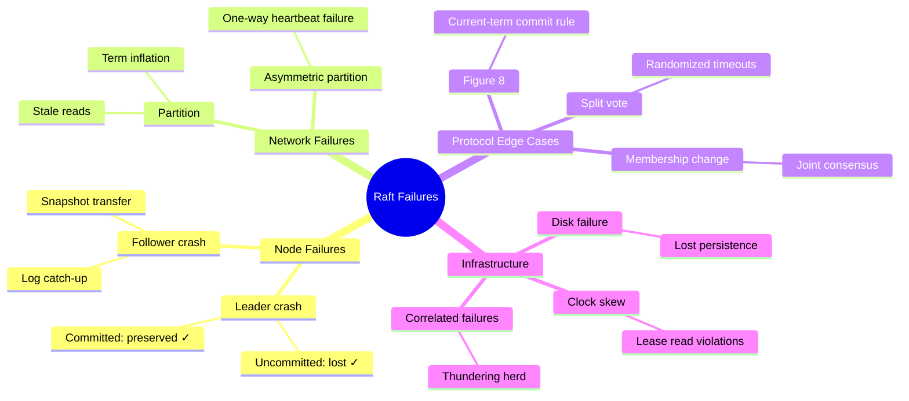

# Chapter 11: Failure Modes — A Practitioner's Field Guide

*If you have spent any meaningful time operating distributed systems in production, you already know the uncomfortable truth: it is not the normal case that will ruin your weekend. It is the failure case. The case you did not think about. The case where a network cable gets unplugged at exactly the wrong moment, or a disk fills up one log entry before a critical fsync, or — and this is the one that really stings — the case where everything appears to be working fine but the system is quietly violating its own invariants in ways that won't surface until a client reads stale data three hours from now.*

*This chapter is an attempt to catalog those failure modes. Not exhaustively — distributed systems have a way of inventing new ways to fail that nobody anticipated — but with enough depth and precision that you will recognize each failure when it arrives at your doorstep, understand why it is happening at the protocol level, and know exactly which lines of library code are supposed to prevent it. We will trace each scenario through the Raft paper's theory, through the library's `RaftLogic.scala`, and through the effects that the runtime must execute correctly.*

*Think of this as a field guide: the kind of book a biologist carries into the forest, full of detailed illustrations and diagnostic keys. Except the forest is your production cluster, and the wildlife is trying to corrupt your replicated state machine.*

---

## A Brief Meditation on Why Distributed Failures Are Hard

Before we start cataloging failure modes, it is worth pausing to understand *why* distributed failures are fundamentally different from the bugs you encounter in single-machine programming.

In a single-process application, failures are usually **total**. The program crashes, the function throws an exception, the assertion fires. You see the failure. You fix it. The world is orderly.

Distributed systems fail **partially**. One node is fine. Another is slow. A third has lost connectivity to the first but can still talk to the second. The first node thinks it is the leader. The third node also thinks it is the leader. They are both correct — from their own local perspective. Neither has enough information to know that the other exists in a conflicting state, and neither has any mechanism to resolve the conflict except by exchanging messages over the very network that caused the problem in the first place.

This is the fundamental insight of the Fischer-Lynch-Paterson impossibility result (1985): in an asynchronous system, there is no way to distinguish a crashed node from a slow one. You cannot tell whether the leader has failed or whether your heartbeat is stuck in a network buffer somewhere between here and the data center in Virginia. And yet you must make a decision — keep waiting (and risk stalling the entire cluster) or elect a new leader (and risk having two leaders simultaneously).

Raft resolves this tension through **terms** — monotonically increasing epoch numbers that serve as logical clocks. Every message carries a term. When a node sees a higher term than its own, it immediately steps down to follower. This mechanism is simple, elegant, and — as we are about to see — the source of several subtle failure modes that emerge when the mechanism interacts with real-world network behavior.

---

## Failure Mode 1: Leader Crash Mid-Replication

### The Scenario

This is the canonical Raft failure mode, the one you'll find in every distributed systems textbook. A three-node cluster is humming along. The leader (Node A) receives a client write, appends entry E₃ at index 3, and begins replicating it:

```
Time      Node A (Leader)     Node B (Follower)    Node C (Follower)
────      ─────────────────   ──────────────────   ──────────────────
t₁        append E₃ locally
t₂        send AE to B ──→   receive E₃ ✓
t₃        send AE to C ──→
t₄        ╳ CRASH             
t₅                            (waiting...)          (AE never arrives)
t₆                            election timeout
t₇                            ──→ RequestVote ──→
t₈                                                  grants vote
t₉                            becomes Leader (term+1)
```

Node A crashed after replicating E₃ to B but before replicating it to C. Node B has E₃. Node C does not. Node B wins the election.

### What Happens Next — The Theory

Here is where the subtlety lies. What happens to E₃? It depends entirely on whether E₃ was **committed** before the crash.

**Case 1: E₃ was not committed.** The leader appended E₃ and sent it to B, but the leader had not yet received the acknowledgment from B (or had not received enough acknowledgments to reach a majority). E₃ is in A's log and B's log, but it was never committed. This means:

- The new leader (B) has E₃ in its log. Since E₃ was from the old term, B will **not** retroactively commit it until B commits an entry from its *own* new term (this is the Raft commit rule from §5.4.2, which exists precisely to prevent the scenario we discuss in Failure Mode 3 below).
- If B receives new writes, it will eventually commit an entry from its own term, and at that point, all prior uncommitted entries (including E₃) become committed as well.
- If, instead, B crashes before committing anything and C wins the next election, C does not have E₃ in its log. C's log is shorter but valid. E₃ would be lost — which is acceptable because it was never committed (never acknowledged to the client as durable).

**Case 2: E₃ was committed.** The leader received acknowledgments from both B and C (a majority in a 3-node cluster) and advanced its `commitIndex` past E₃. In this case:

- The Leader Completeness property (§5.4.3) guarantees that any future leader will have E₃ in its log. This is enforced by the election restriction: a candidate must have a log that is "at least as up-to-date" as the voter's, and since E₃ is on a majority of nodes, any winning candidate must have it.
- E₃ is safe. The client received (or should have received) an acknowledgment. The entry will be applied to every state machine in the cluster.

### Where the Library Enforces This

The critical enforcement happens in `RaftLogic.onRequestVote`, specifically the `isLogUpToDate` check:

```scala
private def isLogUpToDate(
    candidateLastIndex: Long,
    candidateLastTerm: Long,
    myLastIndex: Long,
    myLastTerm: Long
): Boolean =
  candidateLastTerm > myLastTerm ||
    (candidateLastTerm == myLastTerm && candidateLastIndex >= myLastIndex)
```

This function is the reason committed entries can never be lost. If E₃ is committed, then a majority of nodes have it. Any candidate that does not have E₃ will have either a lower last log term or a shorter log, and will fail this check against at least one node in the majority. Since the candidate needs a majority of votes, and at least one node in the committed majority will reject the vote, the candidate cannot win.

The logic is deceptively simple — four lines of code. But those four lines are the load-bearing wall of the entire Raft safety proof.

### Timeline Diagram

```
┌─────────────────────────────────────────────────────────────────────┐
│                    Leader Crash Mid-Replication                     │
│                                                                     │
│  Node A (Leader, term=5)                                            │
│  ┌────────┐  ┌────────┐  ┌────────┐                                 │
│  │ E₁ t=5 │  │ E₂ t=5 │  │ E₃ t=5 │  ← appended, not yet committed. │
│  └────────┘  └────────┘  └────────┘                                 │
│       │           │           │                                     │
│       │           │     replication                                 │
│       ▼           ▼       ┌───┴───┐                                 │
│                           │  ╳    │  ← crash before C receives E₃   │
│                           └───────┘                                 │
│                                                                     │
│  Node B (has E₃)                 Node C (missing E₃)                │
│  ┌────────┐  ┌────────┐  ┌────────┐     ┌────────┐  ┌────────┐      │
│  │ E₁ t=5 │  │ E₂ t=5 │  │ E₃ t=5 │     │ E₁ t=5 │  │ E₂ t=5 │      │
│  └────────┘  └────────┘  └────────┘     └────────┘  └────────┘      │
│                                                                     │
│  If B wins election → E₃ preserved (will be committed with new term)│
│  If C wins election → E₃ lost (acceptable: was never committed)     │
└─────────────────────────────────────────────────────────────────────┘
```

### What Can Go Wrong in Your Runtime

The library's pure logic handles this correctly. But your runtime can still break it:

1. **Acknowledging writes before commit.** If your client-facing layer responds "OK" to the client when the leader *appends* the entry (rather than when it *commits* the entry), the client believes E₃ is durable when it isn't. This is not a Raft bug — it's an integration bug. Always wait for `CommitEntries` before responding to clients.

2. **Not persisting before sending.** If Node B's runtime doesn't execute `PersistHardState` and `AppendLogs` effects before sending the `AppendEntriesResponse`, then B might respond "success" to A (causing A to commit), but then B crashes and loses E₃ from its volatile log. Now E₃ is "committed" but missing from B's durable state. The pure logic emits effects in the correct order — your runtime must preserve that order.

---

## Failure Mode 2: Network Partition — The Classic Split

### The Scenario

A five-node cluster splits into two partitions: {A, B} and {C, D, E}. Node A is the current leader.

```
  Partition 1 (minority)          Partition 2 (majority)
  ┌──────────────────┐          ┌──────────────────────────┐
  │                  │          │                          │
  │   A (Leader)     │  ╳ ╳ ╳   │   C (Follower)           │
  │   B (Follower)   │  ╳ ╳ ╳   │   D (Follower)           │
  │                  │          │   E (Follower)           │
  └──────────────────┘          └──────────────────────────┘
         ↑                                  ↑
    stale leader                    will elect new leader
```

### Why This Is Subtle

From A's perspective, nothing has happened. A is still the leader. Its heartbeats to B succeed. A doesn't know that C, D, and E are unreachable — it could be that they're just slow, or that the network path has high latency this morning. A will continue to accept client writes, append them to its log, replicate them to B, and wait for C, D, or E to respond. They never will.

Meanwhile, in partition 2, election timers on C, D, and E fire. One of them (say C) starts an election. C can reach D and E — a majority of 5. C wins the election in a new term. C is now the legitimate leader. Client writes to C succeed and are committed because C has {C, D, E} — a majority.

At this point, the cluster has two nodes that believe they are leaders: A (old term) and C (new term). This is *not* a safety violation — it's a *liveness* problem. A cannot commit any new writes because it cannot reach a majority. But A doesn't know this yet. It keeps trying.

### What Happens When the Partition Heals

When connectivity is restored, A's messages reach C (or C's messages reach A). The moment A sees a message from a higher term, the protocol's term rule kicks in:

```scala
// In onAppendEntries, line 156-157:
val currentState =
  if req.term > state.term then state.stepDown(req.term) else state
```

Node A steps down to follower in C's term. Any uncommitted entries that A accepted during the partition (replicated only to B) are now **orphaned** — they will be overwritten by C's log during the next `AppendEntries` exchange, where the log matching check will detect the divergence and the follower will truncate its conflicting entries.

This is the `TruncateLog` effect in action:

```scala
case TruncateLog(fromIndex: Long)
// Truncate the log from the given index onwards, removing conflicting entries.
// This occurs when a follower discovers entries that conflict with the leader's log.
```

### The Danger: Stale Reads

The safety violation during a partition is not in *writes* — uncommitted writes are correctly discarded. The danger is in *reads*. If a client is connected to Node A and reads from A's state machine during the partition, the client sees stale data. Specifically:

- C (the real leader) is accepting and committing new writes.
- A's state machine has not applied those writes because A never received them.
- A client reading from A sees a state machine that is frozen in the past.

This is why the ReadIndex and lease-based read protocols exist (Chapter 10). ReadIndex requires the leader to confirm it holds authority — A would try to send heartbeats to confirm, fail to reach a majority, and correctly reject the read request:

```scala
// ReadIndex rejected because leader can't confirm authority
Effect.ReadIndexRejected(requestId = "read-42", leaderHint = None)
```

Without ReadIndex (i.e., naive reads directly from the leader's state), stale reads are not just possible — they are *guaranteed* during any nontrivial partition.

> [!WARNING]
> **The most common production Raft bug is serving reads from a partitioned leader.** If your client library doesn't verify leader freshness, you will serve stale data during partitions. This isn't a theoretical concern — it's happened in production at etcd, Consul, and TiKV, and it will happen to you. Use ReadIndex.

---

## Failure Mode 3: The Figure 8 Scenario — Raft's Most Subtle Bug

### Why This Matters

This failure mode is so subtle that it has its own name in the distributed systems literature and its own figure in the Raft paper (Figure 8, §5.4.2). It is the reason that Raft has a seemingly arbitrary rule: **a leader cannot commit entries from previous terms by counting replicas alone.** Without this rule, Raft would violate its safety guarantee. Understanding why requires careful reasoning about the interplay between elections, log divergence, and commitment.

### The Setup

Consider a five-node cluster going through the following sequence of events. Each step is individually plausible — the kind of thing that happens in production whenever nodes crash and recover:

```
Step 1: S1 is leader in term 2. S1 replicates entry (index=2, term=2)
        to S2 but crashes before reaching S3, S4, S5.

Step 2: S5 wins election for term 3 (S3, S4 vote for S5).
        S5 accepts a different entry at index 2 (term=3).
        S5 crashes before replicating it.

Step 3: S1 restarts, wins election for term 4.
        S1 resumes replicating the old entry (index=2, term=2) to S3.
        Now S1, S2, S3 have (index=2, term=2) — a majority.

DANGER POINT: Should S1 commit (index=2, term=2)?
```

Here is the critical decision. The entry at index 2, term 2 is now on a majority of nodes. The naive commit rule — "commit when replicated to a majority" — says yes, commit it.

**But that would be wrong.**

### Why the Naive Rule Fails

Suppose S1 commits the entry and then crashes. S5 wakes up with its entry at (index=2, term=3). S5 starts an election for term 5. S5's log is *more up-to-date* than S2, S3, S4's logs (it has a higher term at index 2). S5 can win the election. When S5 becomes leader, it replicates its entry at (index=2, term=3), overwriting the "committed" entry at (index=2, term=2) on S2 and S3.

A committed entry was just overwritten. The State Machine Safety property is violated. Any client that was told "your write at index 2 is durable" was lied to.

```
The Figure 8 Failure:

        Index:     1      2
        ──────────────────────
S1  →   │ t=1  │  t=2  │     ← leader term 4, replicated to majority
S2      │ t=1  │  t=2  │     ← has entry
S3      │ t=1  │  t=2  │     ← just received entry
S4      │ t=1  │       │
S5      │ t=1  │  t=3  │     ← different entry, higher term!
        ──────────────────────

If S1 commits (index=2, term=2) and crashes,
S5 can win election (its term 3 > term 2) and overwrite "committed" data.
```

### Raft's Fix: The Current-Term Commitment Rule

Raft resolves this with a deceptively simple rule: **a leader only commits entries from its current term.** Entries from previous terms are committed *indirectly* — when a new entry from the current term is committed, all preceding entries (including those from old terms) are committed along with it.

In our scenario, S1 (leader in term 4) should *not* directly commit (index=2, term=2) even though it's on a majority. Instead, S1 should first append and replicate a new entry from term 4 — even a no-op — and commit *that*. Once the term-4 entry is committed, the term-2 entry is committed as well (because commitment is a prefix property: if index 3 is committed, all entries at index ≤ 3 are committed).

This works because if S5 tries to win an election after the term-4 entry is on a majority, S5's log is no longer up-to-date — S5 doesn't have the term-4 entry, and voters in the majority will reject its vote.

### Where the Library Enforces This

The commit advancement logic in `RaftLogic.onAppendEntriesResponse`:

```scala
case l: Leader if resp.success =>
  val newCommitIndex = l.calculateCommitIndex(clusterSize, getTermAt)
  if newCommitIndex > l.commitIndex then
    Transition(l.withCommitIndex(newCommitIndex), List(CommitEntries(newCommitIndex)))
  else Transition.pure(l)
```

The `calculateCommitIndex` method must check that the entry at the potential new commit index has the **leader's current term**. If it only counts replicas without checking the term, the Figure 8 scenario can occur. This is why `getTermAt` is passed as a parameter — so the leader can verify the term of the entry before committing it.

Additionally, the `BecomeLeader` effect triggers the runtime to append a **no-op entry** in the new leader's term. This no-op is the mechanism by which prior-term entries get indirectly committed:

```scala
// When a node becomes leader, the runtime appends a no-op in the current term.
// This no-op, once committed, retroactively commits all previous entries.
case BecomeLeader => // runtime appends no-op entry with leader's term
```

> [!IMPORTANT]
> **The Figure 8 scenario is the most dangerous failure mode in Raft** because it violates safety silently. There is no crash, no error message, no exception. The system simply applies different entries at the same index on different nodes, and you don't discover it until a client reads inconsistent data. The library's `calculateCommitIndex` prevents it, but if you ever modify the commit logic, this is the invariant you must not break.

---

## Failure Mode 4: Split Vote — The Liveness Trap

### The Scenario

Three nodes, no current leader. All three election timers fire at roughly the same moment. Each node votes for itself and broadcasts `RequestVote` to the others. Node A votes for itself and receives Node B's vote request — but A already voted for itself, so it rejects. Node B votes for itself and rejects A's request. Node C does the same. Nobody gets a majority.

```
Node A: votes for A → rejects B → rejects C → 1 vote (needs 2)
Node B: votes for B → rejects A → rejects C → 1 vote (needs 2)
Node C: votes for C → rejects A → rejects B → 1 vote (needs 2)

Result: no leader elected. Entire round wasted.
```

### Why It Matters

Split votes don't violate safety — the Election Safety property is trivially satisfied because no leader was elected at all. The problem is **liveness**: the cluster is unable to make progress. If the same thing happens in the next round (and the next, and the next), the cluster is effectively stuck.

### The Randomization Fix

Raft prevents persistent split votes through **randomized election timeouts**. Each node picks a random timeout in the range `[electionTimeoutMin, electionTimeoutMax]`. The probability that all three nodes pick exactly the same timeout is vanishingly small. In practice, one node's timer fires first, it sends `RequestVote` before the others start their own elections, and it wins cleanly.

The library enforces this through the `ResetElectionTimer` effect:

```scala
case ResetElectionTimer
// The runtime must use a DIFFERENT random duration each time this fires.
// Deterministic timeouts → persistent split votes → liveness failure.
```

This is one of those cases where the library's pure logic is correct but the runtime can violate liveness by using deterministic timeouts. The `TimerService` SPI contract requires randomization:

```scala
trait TimerService[F[_]]:
  def resetElectionTimer: F[Unit]   // MUST use randomized duration
  def resetHeartbeatTimer: F[Unit]  // can use fixed interval
```

### Quantifying the Risk

How likely is a split vote? For a 3-node cluster with election timeouts uniformly distributed in [150ms, 300ms]:

- The probability that any two nodes' timeouts overlap within a 10ms window (typical message round-trip) is roughly `10 / 150 ≈ 6.7%`.
- The probability that *all three* overlap is roughly `(10/150)² ≈ 0.44%`.
- The probability of *two consecutive* split votes is `0.44% × 0.44% ≈ 0.002%`.

In practice, split votes resolve within 1-2 rounds. Persistent split votes (more than 3 rounds) indicate a problem with your timer implementation. Check that your `TimerService` is actually using random durations and that the range is wide enough (the Raft paper recommends at least a 2:1 ratio between max and min).

---

## Failure Mode 5: Term Inflation from Partitioned Nodes

### The Scenario

Node D is partitioned from the rest of the cluster. It doesn't know the leader is alive. Its election timer fires. It starts an election, incrementing its term. Nobody responds (because nobody can reach it). The election fails. The timer fires again. Another election, another term increment. This continues for minutes or hours.

When the partition heals, Node D's term is enormous — say, term 47 — while the rest of the cluster is at term 5. Node D sends a message with term 47. Every node that receives it immediately steps down to follower in term 47 (the term rule). The current leader is deposed. A new election begins, unnecessarily.

```
Before partition heals:          After partition heals:
  Cluster: term 5 (stable)        Node D sends msg with term 47
  Node D: term 47 (inflated)      All nodes step down → term 47
                                   Needless election disruption
```

### The Theory: Why Terms Are Dangerous

The term mechanism in Raft is a double-edged sword. It's essential for safety — terms prevent two leaders from coexisting (a node in a lower term always defers to a higher term). But it also means that any node, even a disconnected one that cannot possibly win an election, can disrupt the entire cluster simply by having a high term number.

This is a consequence of a fundamental design choice in Raft: terms are a **total order** shared by all nodes, and any node can unilaterally advance the global term. There is no mechanism in basic Raft to verify that a term advancement is "legitimate" (backed by a real election with a real quorum).

### The Fix: Pre-Vote

The Pre-Vote protocol (Raft dissertation §9.6) addresses this by adding a preliminary phase before the real election:

```scala
case f: Follower if config.preVoteEnabled =>
  // Pre-vote phase: don't increment term yet
  val preCandidate = PreCandidate(f.term, Set(config.localId))
  val voteReq = RequestVoteRequest(
    term = f.term + 1,  // Request votes for NEXT term
    candidateId = config.localId,
    lastLogIndex = lastLogIndex,
    lastLogTerm = lastLogTerm,
    isPreVote = true       // ← this is the key flag
  )
  Transition(
    preCandidate,
    List(Broadcast(voteReq), ResetElectionTimer)
    // No PersistHardState — pre-vote doesn't change durable state
  )
```

The crucial detail: `isPreVote = true` and **no `PersistHardState` effect**. The pre-vote doesn't change the node's term. It's purely exploratory. "Would you vote for me *if* I started an election?" If a majority says yes, the node proceeds with a real election. If not — because it's partitioned and can't reach a majority — it stays at its current term. No inflation.

When a follower receives a pre-vote request, it responds based on the same `isLogUpToDate` check but does **not** update its own `votedFor`:

```scala
val newFollower =
  if req.isPreVote then f           // don't change votedFor for pre-votes
  else f.copy(votedFor = Some(req.candidateId))
```

This is carefully designed: pre-votes don't consume the real vote, so a pre-vote response doesn't prevent the node from voting in a subsequent real election.

---

## Failure Mode 6: Slow Follower and the Thundering Herd

### The Scenario

In a five-node cluster, one follower (Node E) has a degraded disk. It takes 50ms to fsync each `AppendLogs` effect instead of the usual 2ms. Without parallel replication, the leader sends entries sequentially:

```
Leader → Node B: 2ms → ack
Leader → Node C: 2ms → ack
Leader → Node D: 2ms → ack
Leader → Node E: 50ms → ack
                  ─────
                  Total: 56ms per round
```

But the commit only requires a majority (3 of 5). With sequential replication, the commit latency is dominated by the third-fastest node (Node D, 6ms cumulative), but the leader doesn't send the next batch until Node E responds (56ms total). The slow follower is holding the entire cluster hostage.

### The Deeper Problem: Correlated Failures

The thundering herd gets worse when failures are correlated. In cloud environments, all your nodes might share the same physical host, the same network switch, or the same storage array. When that resource degrades:

- Multiple followers slow down simultaneously.
- The leader's replication queue builds up.
- Heartbeats are delayed because they share the same outgoing connection pool.
- Followers' election timers fire because heartbeats don't arrive in time.
- Multiple elections start simultaneously → split votes → extended unavailability.

This cascading failure pattern is not addressed by the Raft paper (which assumes independent failures). It requires operational mitigations:

1. **Parallel replication** (`parallelReplicationEnabled = true`): sends to all followers concurrently, so a slow follower doesn't block others.
2. **Separate heartbeat channel**: in production, heartbeats should not share a connection pool with bulk replication. A heartbeat is tiny (no entries, just term + commitIndex) and should always get through quickly.
3. **Learner demotion**: if a follower is consistently slow, convert it to a learner. Learners receive replication for data locality but don't participate in the quorum, so they can't slow down commits or trigger elections.

### Where the Library Helps

The `ParallelReplicate` effect instructs the runtime to send concurrently:

```scala
case ParallelReplicate(targets: Set[NodeId], message: RaftMessage)
// The runtime should execute sends concurrently for improved throughput.
```

With parallel replication enabled, commit latency becomes `max(third-fastest)` rather than `sum(all)`. In the example above, that's 2ms instead of 56ms — a 28× improvement.

---

## Failure Mode 7: Snapshot Transfer Failure and the Infinite Catch-Up Loop

### The Scenario

A follower has been offline for a long time. The leader's log has been compacted — entries before index 10,000 have been replaced by a snapshot. The follower comes back online with only entries up to index 500. The leader cannot send entries 501–10,000 because they no longer exist in the log. The leader must send a snapshot instead.

```
Leader's log:  [snapshot @ 10000] [10001] [10002] [10003] ...
Follower's log: [1] [2] [3] ... [500]

Gap: entries 501-10000 are gone. Only the snapshot covers them.
```

### What Goes Wrong

Snapshot transfer is essentially a file copy over the network. If the snapshot is large (gigabytes for a large state machine), the transfer takes minutes. During that time:

1. **The leader keeps receiving writes.** By the time the snapshot reaches the follower, the leader's log has advanced to index 12,000. The snapshot covers up to 10,000. The follower needs entries 10,001–12,000, which the leader may or may not still have in its log (if the leader compacted again, we're back to square one).

2. **The transfer can fail.** Network hiccups, process restarts, or disk space issues can interrupt the transfer. The follower must restart the entire snapshot download.

3. **The follower is unusable during the transfer.** It's consuming network bandwidth and disk I/O for the snapshot, and it can't participate in the quorum. If the cluster has exactly 2f+1 nodes and one is doing a snapshot transfer, you're operating with zero fault tolerance margin.

### The Fix

The library's `TakeSnapshot` effect triggers snapshot creation at configurable intervals:

```scala
case TakeSnapshot(lastIncludedIndex: Long, lastIncludedTerm: Long)
// Trigger a snapshot at the given index to compact the log.
```

The key is compaction frequency. Too infrequent → snapshots are huge and transfers are slow. Too frequent → you're constantly snapshotting, which consumes disk I/O. A reasonable heuristic:

- **Snapshot every N entries** (e.g., N = 10,000). This bounds the maximum snapshot size to N entries' worth of state machine changes.
- **Snapshot when the log exceeds a size threshold** (e.g., 100 MB). This bounds the disk space used by the log.

For very large state machines (tens of gigabytes), consider **streaming snapshots** — sending the snapshot in chunks so that partial progress is preserved on failure. The library supports this through its `StateMachine` SPI:

```scala
trait StateMachine[F[_], Response]:
  def snapshot: F[Array[Byte]]      // capture current state
  def restore(data: Array[Byte]): F[Unit]  // restore from snapshot
```

In a production implementation, you would implement these methods to support incremental or streaming serialization rather than capturing the entire state in a single `Array[Byte]`.

---

## Failure Mode 8: Clock Skew and Lease-Based Read Violations

### The Scenario

You're using leader lease reads for performance (Chapter 10). The leader received a heartbeat quorum at time T=100, and extended its lease until T=200 (`leaderLeaseDuration = 100ms`). The leader serves reads directly from its local state machine — no network round-trip.

But the leader's clock runs 20ms fast relative to the followers' clocks. The followers' clocks say T=180 when the leader's clock says T=200. From the followers' perspective, only 80ms have elapsed since the heartbeat — the leader should still be legitimate. But from the leader's perspective, the lease has expired.

That's the *safe* direction — the leader's clock is fast, so it stops serving reads *before* the followers could elect a new leader. The dangerous direction is the opposite:

**The leader's clock runs 20ms slow.** The followers' clocks reach T=200 while the leader's clock reads T=180. From the leader's perspective, its lease is still valid (20ms remaining). But the followers may have already started an election, and a new leader may exist. The old leader is serving reads from a state machine that might already be stale compared to the new leader's.

```
┌─────────────────────────────────────────────────────────────┐
│              Clock Skew and Lease Reads                       │
│                                                             │
│  Leader's clock:     ...178  179  180  181  182  183...     │
│  Follower's clock:   ...198  199  200  201  202  203...     │
│   (20ms ahead)                    ↑                         │
│                                   │                         │
│                           Followers may                     │
│                            elect new leader                 │
│                                                             │
│  Leader thinks:  "lease valid until my T=200"               │
│  Reality:        followers already in new term               │
│  Risk:           stale reads for 20ms                        │
└─────────────────────────────────────────────────────────────┘
```

### The Theory: Why Clocks Are Fundamentally Unreliable

Leslie Lamport proved in 1978 that logical time (event ordering without physical clocks) is sufficient for understanding causality in distributed systems. Physical clocks add convenience but also add assumptions. The moment you depend on physical clocks for safety, you are no longer in the world of Raft's proven guarantees — you are in the world of *practical engineering tradeoffs*.

The NTP protocol keeps clocks synchronized within a few milliseconds on a well-configured local network. GPS-disciplined clocks (PTP) achieve microsecond accuracy. But even NTP can produce spikes during NTP server failover, VM migration, or leap second adjustments. Google's TrueTime API (used in Spanner) addresses this by providing a clock API that returns a *confidence interval* rather than a point estimate, but this requires dedicated hardware (GPS receivers and atomic clocks) and is not available in commodity environments.

### The Library's Approach

The `ExtendLease` effect carries a timestamp:

```scala
case ExtendLease(until: Long)
// until = currentTimeMillis + leaderLeaseDuration - maxClockSkew
```

The `maxClockSkew` subtraction is the safety margin. If you set `leaderLeaseDuration = 100ms` and `maxClockSkew = 20ms`, the effective lease is 80ms. This means the leader will expire its lease 20ms before followers *could* elect a new leader, providing a safety buffer.

The tradeoff: larger `maxClockSkew` → shorter effective lease → more frequent fallbacks to ReadIndex → higher read latency. Smaller `maxClockSkew` → longer effective lease → lower read latency → higher risk of stale reads if your clock assumption is wrong.

> [!CAUTION]
> **Never set `maxClockSkew` to zero.** If you have any physical clock dependence (lease reads, TTL-based locks), you must assume some skew. Even within a single data center, 1-5ms of skew is common. Across data centers, 10-50ms is typical. When in doubt, use ReadIndex instead of lease reads — it's slower but correct regardless of clock behavior.

---

## Failure Mode 9: Membership Change During Instability

### The Scenario

You are performing a cluster membership change — adding a fourth node to a three-node cluster. The process involves a two-phase joint consensus protocol (Chapter 3). In the first phase, the old configuration {A, B, C} and the new configuration {A, B, C, D} both need to agree. During this window, operations require majorities in *both* configurations:

- Old majority: 2 of {A, B, C}
- New majority: 3 of {A, B, C, D}

If node A (the leader) crashes during the joint phase, the cluster must elect a new leader under joint consensus rules. This is harder than a normal election because the new leader must win a majority in both the old and new configurations. If D is still catching up (not yet fully replicated), it might be impossible to get both majorities simultaneously.

### Why Joint Consensus Is Safer Than Single-Step Changes

The Raft paper (§6) originally proposed single-step membership changes — directly switching from the old configuration to the new one. This is simpler but creates a window where the old and new configurations could each independently elect a leader, violating Election Safety.

Joint consensus (from the Raft dissertation) eliminates this window by requiring both configurations to agree during the transition. The cost is complexity:

```
Normal operation:        Majority of {A, B, C} = 2
Joint consensus:         Majority of {A, B, C} = 2 AND majority of {A, B, C, D} = 3
After transition:        Majority of {A, B, C, D} = 3
```

### Practical Advice

1. **Never change membership during instability.** If the cluster is experiencing leader elections, network issues, or slow followers, adding or removing nodes will make things worse. Wait for stability.

2. **Add one node at a time.** Even though joint consensus can handle arbitrary configuration changes, adding multiple nodes simultaneously increases the risk that the joint phase cannot make progress (because the new nodes are all catching up simultaneously).

3. **Wait for the new node to catch up before starting the transition.** If node D needs to receive 100,000 log entries before it's up to date, let it do that as a learner first. Once it's close to the leader's log index, promote it to a voter via the joint consensus mechanism.

4. **Monitor the joint phase closely.** If the joint phase stalls (entries aren't being committed), the cluster is in a vulnerable state — it needs both majorities. Have a rollback plan: revert to the old configuration by submitting a new configuration entry.

---

## The Taxonomy of Distributed Failures

To wrap up, here is a systematic classification of the failure modes we've covered, organized by the layer at which they occur and the Raft property they threaten:

| Failure Mode | Layer | Threatens | Prevention |
|-------------|-------|-----------|------------|
| Leader crash mid-replication | Node | Leader Completeness | `isLogUpToDate` election restriction |
| Network partition (stale reads) | Network | Linearizability | ReadIndex / lease reads with margin |
| Figure 8 (term mismatch commit) | Protocol | State Machine Safety | Current-term commitment rule |
| Split vote | Protocol | Liveness | Randomized election timeouts |
| Term inflation | Network | Liveness | Pre-Vote protocol |
| Slow follower | Node | Throughput | Parallel replication, learner demotion |
| Snapshot transfer failure | Storage | Availability | Streaming snapshots, compaction tuning |
| Clock skew | Infrastructure | Linearizability | `maxClockSkew` margin, ReadIndex fallback |
| Membership change instability | Protocol | Election Safety | Joint consensus, staged changes |



---

## A Final Word: The Difference Between Theory and Practice

Theoretical distributed systems research gives us the tools to *prove* that an algorithm is correct. The FLP impossibility result tells us what cannot be achieved. The Raft paper proves that its five safety properties hold under the model's assumptions. These proofs are valuable, essential, indispensable even.

But they are not sufficient.

The proofs assume a particular failure model (crash-stop, not Byzantine), a particular network model (asynchronous but eventually reliable), and a particular storage model (durable writes that survive crashes). Every one of these assumptions can be violated in practice. Disks lie about fsyncs. Networks deliver messages out of order. NTP servers go insane during leap seconds. Entire data centers lose power. And — this is the one that keeps distributed systems engineers up at night — sometimes the failures are *partial*: the disk fsyncs most of the time, the network delivers most messages, the clocks are mostly synchronized. The "mostly" is where the bugs live.

The library's pure functional design helps here. By separating the protocol logic (which is proven correct) from the runtime effects (which interact with the unreliable real world), the library gives you a clear boundary: everything inside `RaftLogic.onMessage` is correct by construction. Everything outside — your `Transport`, your `LogStore`, your `StableStore`, your `TimerService` — is where reality can diverge from the model. When debugging a production failure, start at that boundary. Check the effects. Verify they were executed. Verify they were executed *in order*. Nine times out of ten, that's where the bug is.

The remaining one time out of ten? That's when you open the Raft paper, re-read §5.4.2, and discover that you have a Figure 8 in your living room.

---

*Next: [Chapter 12 — Case Study: Distributed Key-Value Store](12-case-distributed-kv.md) puts everything we've learned into practice — building a complete replicated data store with linearizable reads, snapshot recovery, and real client semantics.*
