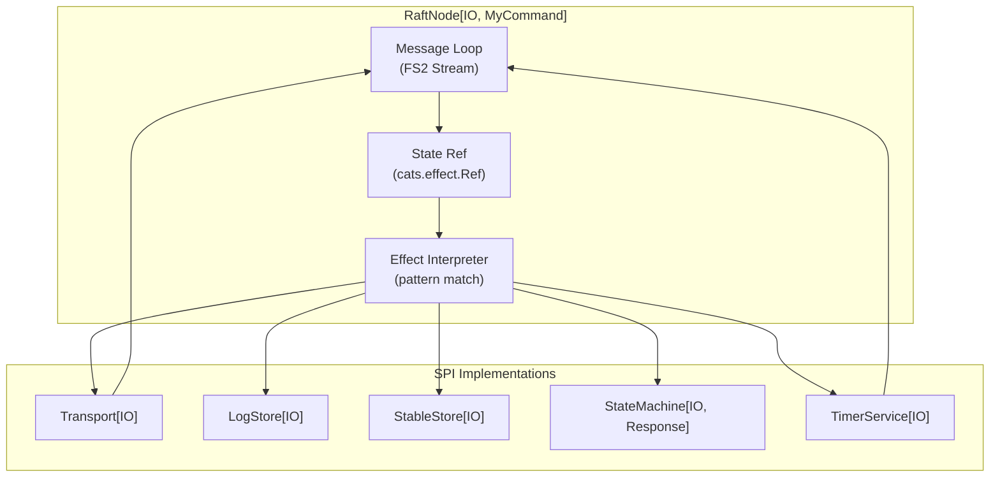
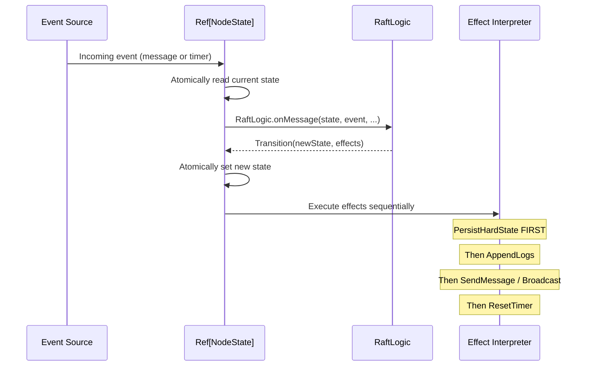
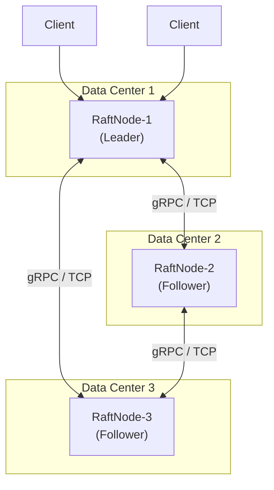

# Chapter 16: End-to-End Integration with RaftNode

*The previous chapters built your understanding from pure functions to complete applications. This chapter shows how to wire everything together using `RaftNode[F, M]` — the library's ready-made runtime that combines the pure protocol logic with real SPI implementations into a running Raft cluster.*

---

## The Gap Between Pure Logic and a Running Cluster

Throughout this book, we've called `RaftLogic.onMessage` directly and manually interpreted effects. This is powerful for learning and testing, but for production you need:

- A **message loop** that continuously receives and processes events
- **Concurrent timers** that fire election timeouts and heartbeat ticks
- **Persistent storage** that survives process restarts
- **Network transport** that delivers messages to the right nodes
- **Thread safety** for concurrent event sources

The `RaftNode` class handles all of these concerns:



## Creating a RaftNode

```scala
import cats.effect.{IO, IOApp, Ref}
import raft.*
import raft.state.*
import raft.spi.*
import raft.impl.*

object MyRaftApp extends IOApp.Simple:

  val nodeId = NodeId("node-1")
  val peers  = List(NodeId("node-2"), NodeId("node-3"))

  val config = RaftConfig(
    localId = nodeId,
    preVoteEnabled = true,
    heartbeatInterval = 150.millis,
    electionTimeoutMin = 1500.millis,
    electionTimeoutMax = 3000.millis,
    batching = BatchConfig(enabled = true, maxSize = 100, maxWait = 10.millis),
    pipelining = PipelineConfig(enabled = true, maxInflight = 10),
    parallelReplicationEnabled = true
  )

  def run: IO[Unit] =
    for
      // Initialize SPI implementations
      transport   <- InMemTransport[IO]
      logStore    <- InMemLogStore[IO]
      stableStore <- InMemStableStore[IO]
      timerSvc    <- DefaultTimerService[IO](config)

      // Define your state machine
      stateMachine = new StateMachine[IO, String]:
        private val state = Ref.unsafe[IO, Map[String, String]](Map.empty)
        def apply(entry: Log): IO[String] =
          val cmd = new String(entry.data)
          val Array(key, value) = cmd.split("=", 2)
          state.modify(s => (s + (key -> value), s"OK: $key=$value"))
        def snapshot: IO[Array[Byte]] = state.get.map(_.toString.getBytes)
        def restore(data: Array[Byte]): IO[Unit] = IO.unit

      // Create and start the RaftNode
      node <- RaftNode.create(config, transport, logStore, stableStore,
                              stateMachine, timerSvc, peers)
      _    <- node.start
    yield ()
```

## How Event Processing Works

The `RaftNode` event loop follows a strict sequence for each incoming event:



> [!IMPORTANT]
> **Persistence before communication.** The effect interpreter must execute `PersistHardState` and `AppendLogs` effects **before** sending any messages. This ordering is critical for safety — if the node crashes after sending a message but before persisting its state, it could violate Raft's safety invariants on restart. The `RaftNode` runtime enforces this ordering automatically.

## Implementing Production SPIs

The in-memory SPI implementations are perfect for testing and examples but not for production. Here's guidance for building real implementations:

### Transport: Network Communication

For production, you need a real network transport. Common choices:

| Technology | Pros | Cons |
|-----------|------|------|
| **gRPC** | Strong typing, streaming, HTTP/2 multiplexing | Complexity, code generation |
| **HTTP/2** | Simple, widely supported | Overhead for high-frequency messages |
| **TCP sockets** | Lowest latency, full control | Must handle framing, reconnection |

Key requirements from the `Transport[F]` SPI (see [Chapter 7](07-spi-layer.md)):
- Messages must be delivered **in order** between any two nodes
- The transport must handle reconnection transparently
- Broadcast should be concurrent (don't let a slow node block others)

### LogStore: Persistent Log

The log must survive process restarts. Options:

| Technology | Append Throughput | Recovery Time |
|-----------|------------------|---------------|
| **Write-ahead log (custom)** | Highest (sequential I/O) | Fast (replay from last checkpoint) |
| **RocksDB / LevelDB** | High (LSM-tree) | Medium (compaction needed) |
| **SQLite** | Medium | Fast |
| **Flat files** | Low | Slow (full scan) |

> [!WARNING]
> The `LogStore` must call `fsync()` (or equivalent) after every write. Without `fsync`, the OS may buffer writes in memory, and a power failure could lose acknowledged entries. This is the most common source of data loss in Raft deployments.

### StableStore: Term and VotedFor

The `StableStore` persists exactly two values: the current `term` and `votedFor`. These must be durable and survive crashes. A single file with two fields, fsynced on every write, is sufficient.

### TimerService: Election and Heartbeat Timers

The `DefaultTimerService` implementation uses FS2 streams with `Stream.fixedDelay`. For production, ensure:

- Election timeouts are **randomized** on each reset
- Heartbeat ticks are **regular** with minimal jitter
- Timer resolution is sufficient for your timeout settings (avoid timers with >50ms jitter if your election timeout is 500ms)

## Testing Your Integration

The pure protocol tests (333 of them) verify the library's internal logic. You need additional tests for your SPI integration:

```scala
class IntegrationSpec extends AnyFlatSpec:

  "A 3-node cluster" should "elect a leader within one election timeout" in:
    // Create 3 RaftNode instances with InMemTransport
    // Connect them (register in each other's transport)
    // Wait for election timeout
    // Assert exactly one node reports Leader state

  it should "replicate and commit a write" in:
    // Submit a write to the leader
    // Wait for commit
    // Verify all nodes have the entry in their log
    // Verify state machine was applied on all nodes

  it should "survive leader failure" in:
    // Stop the leader (disconnect from transport)
    // Wait for new election
    // Verify a new leader is elected
    // Verify writes continue to work
```

## Deployment Topology



For WAN deployments, consider:
- **Higher election timeouts** (2–5 seconds) to avoid flaky elections across data centers
- **Pipelining** to overlap round-trips (see [Chapter 9](09-log-replication-practice.md))
- **Lease-based reads** at followers to distribute read load (see [Chapter 3](03-raft-advanced-theory.md))
- **Learner nodes** in remote data centers for read replicas without affecting write quorum

---

*Next: [Chapter 17 — Property-Based Testing](17-property-based-testing.md) shows how to express Raft's safety invariants as ScalaCheck properties and verify them with random message schedules.*
