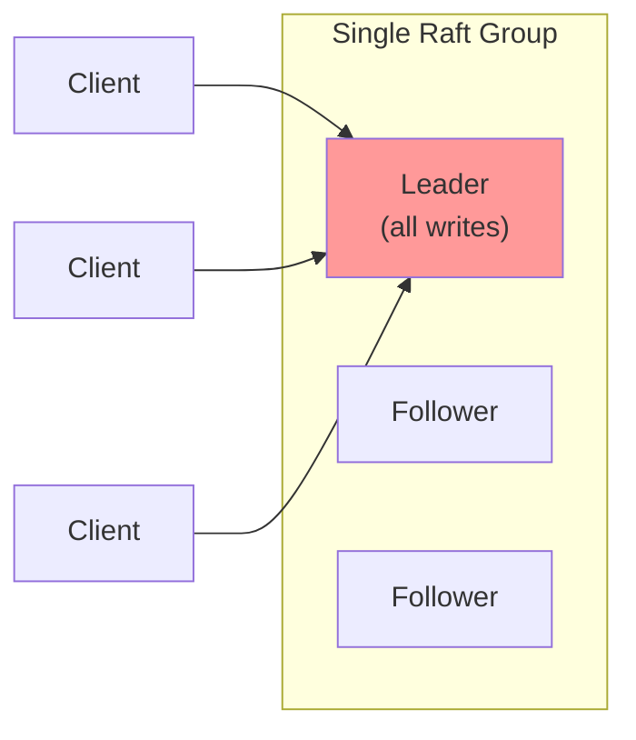
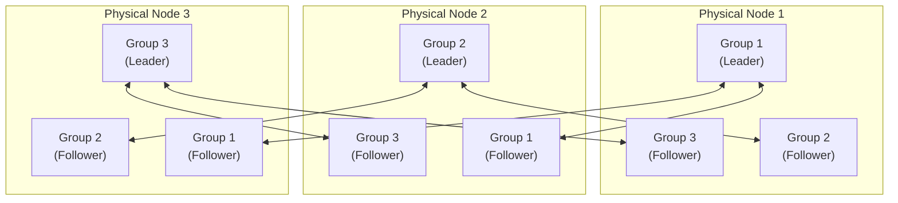
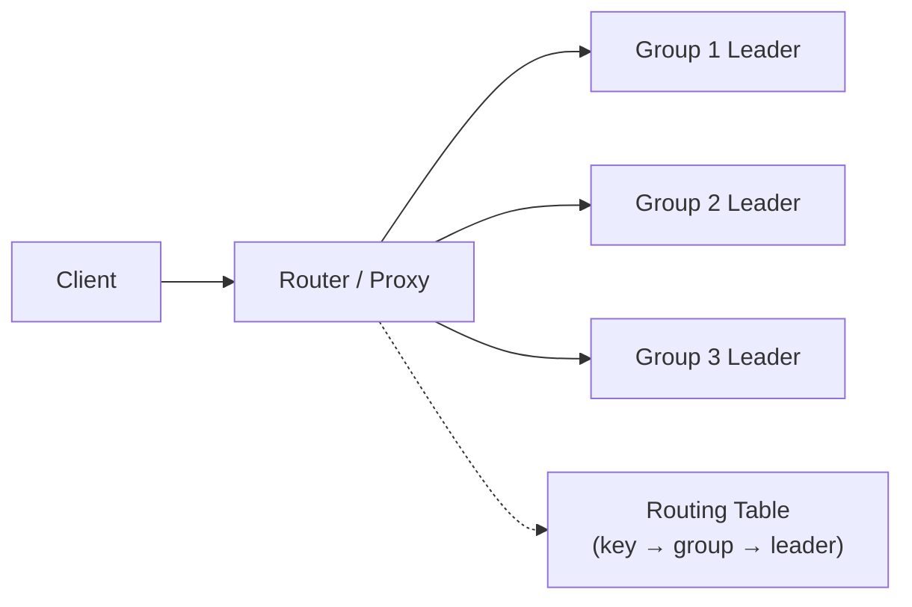

# Chapter 17: Multi-Raft Group Design

*A single Raft group provides strong consistency for a replicated state machine, but it has inherent scalability limits: all writes go through one leader, the entire dataset must fit on every node, and throughput is bounded by the slowest majority member. This chapter discusses how to scale beyond those limits by partitioning data across multiple independent Raft groups — a pattern used by CockroachDB, TiKV, Yugabyte, and most production distributed databases.*

---

## Why a Single Group Isn't Enough

A single Raft group has three fundamental bottlenecks:



| Bottleneck | Why | Impact |
|-----------|-----|--------|
| **Write throughput** | All writes go through one leader | One node's CPU/disk is the ceiling |
| **Data size** | Every node stores the full dataset | Dataset limited to one machine's storage |
| **Read distribution** | Linearizable reads need leader confirmation | Read load concentrates on one node |

## The Multi-Raft Architecture

The solution is **sharding**: partition the dataset across multiple independent Raft groups, each responsible for a subset of the data (a **range** or **partition**). Each group has its own leader election, replication, and commit tracking.



In this arrangement:
- Each **Raft group** manages a portion of the keyspace (e.g., Group 1 handles keys `a-h`, Group 2 handles `i-p`, Group 3 handles `q-z`)
- Each **physical node** hosts replicas from multiple groups
- **Leadership is distributed** — different groups can have leaders on different nodes, spreading write load

## Partitioning Strategies

### Range Partitioning

Assign contiguous key ranges to each group:

| Group | Key Range | Example Keys |
|-------|-----------|-------------|
| Group 1 | `[a, h)` | `account:alice`, `balance:bob` |
| Group 2 | `[h, p)` | `inventory:laptop`, `order:12345` |
| Group 3 | `[p, z)` | `session:abc`, `user:carol` |

**Pros:** Range scans are efficient (all keys in a range are in one group). Splitting is natural — just bisect the range.

**Cons:** Hotspots if the workload is skewed (e.g., all keys start with `user:`).

### Hash Partitioning

Hash the key and assign based on the hash modulo the number of groups:

```
group(key) = hash(key) % numGroups
```

**Pros:** Even distribution regardless of key patterns.

**Cons:** Range scans require querying all groups. Resharding changes key-to-group mapping.

### CockroachDB's Approach

CockroachDB uses **range partitioning with automatic splitting and merging**. When a range's data grows beyond a configurable threshold (64 MB by default), the range is automatically split into two. When adjacent ranges shrink, they merge. This keeps ranges balanced without manual intervention.

## Key Design Challenges

### 1. Routing: Which Group Handles This Key?

The client (or a proxy layer) needs to know which group owns each key. Options:



- **Client-side routing table**: the client caches the key-to-group mapping. If a key's group has moved (due to a split or leader change), the group returns a redirect and the client updates its cache. This is how CockroachDB and TiKV work.
- **Proxy routing**: a stateless proxy layer handles routing. Simpler for clients, but adds one hop of latency.

### 2. Cross-Group Transactions

A single Raft group provides linearizable operations within its key range. But what if a transaction spans keys in different groups?

```
Transaction: Transfer $100 from account:alice (Group 1) to account:bob (Group 2)
```

This requires **distributed transactions** — a separate protocol on top of Raft. The standard approach is **two-phase commit (2PC)** between the groups, with each group acting as a participant:

1. **Prepare**: Each involved group writes a `Prepared` entry to its Raft log
2. **Commit/Abort**: A coordinator group writes the decision, then each participant commits or rolls back

> **Note — Raft + 2PC.** TiKV and CockroachDB both use Raft for replication within each shard and 2PC (with optimizations like parallel commits and pipelining) for cross-shard transactions. The key insight is that 2PC's vulnerability to coordinator failure is mitigated by Raft: the coordinator itself is a Raft group, so it survives crashes. See the Percolator paper (*Peng & Dabek, "Large-scale Incremental Processing Using Distributed Transactions and Notifications", OSDI 2010*) for Google's original approach, which TiKV adapts.

### 3. Leader Balancing

If all group leaders land on the same physical node, you've recreated the single-leader bottleneck. Production systems actively balance leadership:

- **Preferred leader**: each group has a preferred leader location, and leadership transfer (see [Chapter 3](03-raft-advanced-theory.md)) moves leadership there after disruptions
- **Load-based balancing**: a control plane monitors write load per node and triggers leadership transfers to balance it
- **Rack/zone awareness**: ensure each group has replicas in different failure domains

### 4. Transport Multiplexing

With *N* groups and *M* physical nodes, there are potentially `N × (M-1)` logical connections. This is wasteful — you should multiplex multiple Raft groups over a single physical connection per node pair:

```
Physical Node 1 ←→ Physical Node 2
  └─ Group 1 messages
  └─ Group 2 messages
  └─ Group 3 messages
```

This requires a transport layer that routes messages to the correct group based on a group ID in the message header.

## How This Library Supports Multi-Raft

This library's pure functional design makes multi-raft natural. Each Raft group is an independent `RaftNode` instance, and you can run many of them in the same process:

```scala
// Conceptual sketch — run 100 Raft groups on one node
val groups: List[RaftNode[IO, MyCommand]] =
  (0 until 100).toList.map { groupId =>
    val config = RaftConfig(
      localId = NodeId(s"node-1-group-$groupId"),
      // ... configuration
    )
    RaftNode.create(config, sharedTransport, logStore(groupId), ...)
  }

// Start all groups concurrently
groups.parTraverse_(_.start)
```

Because `RaftLogic.onMessage` is a pure function with no global state, there are no concurrency hazards between groups. Each group's state is isolated in its own `Ref[IO, NodeState]`.

## Resource Sharing Across Groups

Running many groups on one node introduces resource management concerns:

| Resource | Sharing Strategy | Pitfall |
|----------|-----------------|---------|
| **Transport** | One TCP connection per node pair, multiplexed | Message ordering must be per-group, not per-connection |
| **Disk** | Shared WAL with per-group log prefixes | A slow group's `fsync` blocks all groups sharing the disk |
| **Timers** | Shared timer wheel with per-group deadlines | Too many groups → timer granularity degrades |
| **CPU** | Cats Effect fiber pool (work-stealing) | A group with expensive `apply` can starve others |

## Scaling Considerations

| Cluster Size | Groups | Leaders per Node | Approx. Write Throughput |
|-------------|--------|-----------------|------------------------|
| 3 nodes | 1 | 0-1 | 1× (single leader) |
| 3 nodes | 10 | ~3 | ~3× (leadership spread) |
| 3 nodes | 100 | ~33 | ~10× (diminishing returns from coordination) |
| 9 nodes | 100 | ~11 | ~9× (more nodes = more parallelism) |

> **Note — Diminishing returns.** More groups doesn't linearly increase throughput because each group still contends for disk I/O, network bandwidth, and CPU. The sweet spot depends on your hardware: SSDs handle many concurrent random writes well, HDDs do not. Profile with your actual workload.

---

*Next: [Chapter 18 — Jepsen-Style Verification](18-jepsen-verification.md) shows how to prove your Raft implementation is correct under real-world failure conditions using Jepsen-style testing with fault injection and linearizability checking.*

