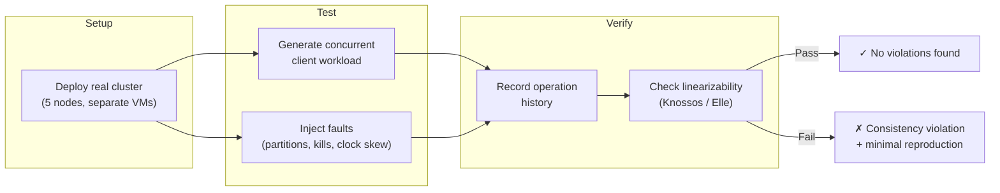
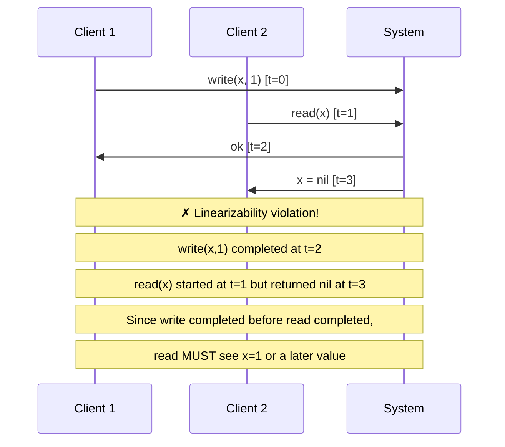
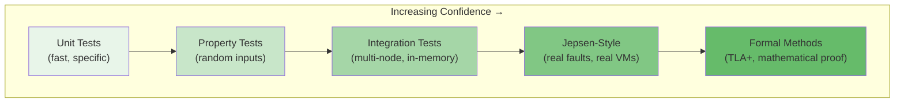

# Chapter 20: Jepsen-Style Verification

*You've written unit tests, property-based tests, and debugged your cluster with the troubleshooting checklist. But the most dangerous bugs in distributed systems don't show up in any of these — they emerge only under real-world failure conditions: network partitions healing at exactly the wrong moment, a leader crashing mid-replication, clock skew interacting with lease reads. This chapter introduces Jepsen-style verification — the gold standard for proving that a consensus implementation actually works under chaos.*

---

## What Is Jepsen?

[Jepsen](https://jepsen.io) is a framework created by Kyle Kingsbury (Aphyr) that tests distributed systems for correctness under real-world fault injection. It has uncovered critical bugs in nearly every major distributed database and consensus system — MongoDB, Elasticsearch, Redis, CockroachDB, etcd, Consul, and many others.

The methodology is deceptively simple:



The key insight: **you don't test specific failure scenarios**. Instead, you run a workload while randomly injecting faults, record every operation, and then mathematically verify that the recorded history is consistent with the claimed consistency model (usually linearizability).

## Why Unit Tests Aren't Enough

Consider this scenario that no reasonable developer would write a unit test for:

1. Leader **L1** in term 5 sends `AppendEntries` to followers F1, F2
2. A network partition isolates L1 from F1 and F2
3. F1 and F2 elect **L2** in term 6
4. L2 commits a new entry at index 10
5. The partition heals
6. L1 (now a stale leader in term 5) receives a client read via lease-based reads
7. L1's lease hasn't expired yet (clock skew — L1's clock is 50ms behind)
8. L1 serves a stale read that doesn't include L2's committed entry at index 10

**Result**: linearizability violation. The client observes a state that never existed in any sequential execution of operations.

This bug requires:
- A specific partition timing
- A specific clock skew amount
- A client read arriving during the stale lease window
- The lease expiration being just barely overdue

No amount of manual test writing reliably finds this. Jepsen does, because it generates thousands of random schedules and checks *all* of them.

## The Jepsen Architecture

A Jepsen test has five components:

### 1. The Database Under Test (DB)

The system being tested. For our library, this would be a Raft cluster built with `RaftNode`:

```scala
// Jepsen deploys and manages this
object RaftKVServer extends IOApp.Simple:
  def run: IO[Unit] =
    for
      node <- RaftNode.create(config, transport, logStore, stableStore,
                              kvStateMachine, timerService, peers)
      _    <- node.start
      _    <- HttpServer.start(node)  // expose KV API for Jepsen clients
    yield ()
```

### 2. The Client

Generates operations against the cluster. Jepsen clients are written in Clojure but conceptually simple:

```clojure
;; Pseudocode — actual Jepsen clients are Clojure
(defn client-operation []
  (case (rand-nth [:read :write :cas])
    :read  {:type :invoke, :f :read,  :key (rand-key), :value nil}
    :write {:type :invoke, :f :write, :key (rand-key), :value (rand-int)}
    :cas   {:type :invoke, :f :cas,   :key (rand-key),
            :value [(rand-int) (rand-int)]}))
```

Each operation is recorded as an **invocation** (when the client sends the request) and a **completion** (when the client receives the response, or a timeout). This creates a **history** — an ordered list of `[invoke, ok/fail/info]` pairs.

### 3. The Nemesis (Fault Injector)

The most important component. The nemesis injects faults into the running cluster:

| Nemesis | What It Does | What It Tests |
|---------|-------------|---------------|
| **Partition** | Isolates subsets of nodes using `iptables` | Leader election, log consistency, stale reads |
| **Kill** | `kill -9` a node process | Crash recovery, persistence durability |
| **Pause** | `SIGSTOP` / `SIGCONT` a process | GC pause simulation, election timeout sensitivity |
| **Clock skew** | `ntpd` manipulation, `faketime` | Lease-based reads, timeout correctness |
| **Disk corruption** | Truncate/corrupt WAL files | Persistence layer robustness |

A typical nemesis schedule:

```
t=0s    Start workload (5 clients, 100 ops/sec)
t=5s    Partition: {n1, n2} | {n3, n4, n5}
t=15s   Heal partition
t=20s   Kill n3 (SIGKILL)
t=25s   Restart n3
t=30s   Clock skew: n1 +200ms, n4 -200ms
t=40s   Partition: {n1} | {n2, n3} | {n4, n5}
t=50s   Heal all, stop workload
```

### 4. The History

Every client operation is recorded with precise timestamps:

```
{:index 0, :type :invoke, :f :write, :key "x", :value 1, :time 1000000}
{:index 1, :type :invoke, :f :read,  :key "x", :value nil, :time 1500000}
{:index 2, :type :ok,     :f :write, :key "x", :value 1, :time 2000000}
{:index 3, :type :ok,     :f :read,  :key "x", :value nil, :time 2500000}
  ↑ BUG: read returned nil AFTER the write of 1 was acknowledged
```

### 5. The Checker (Linearizability Verification)

The checker takes the history and verifies it against a formal consistency model. For linearizability, it must find a **total ordering** of operations that:

1. Respects real-time ordering (if op A completes before op B starts, A must appear before B)
2. Is consistent with the sequential specification (reads return the latest written value)



Jepsen uses two checkers:

| Checker | Algorithm | Complexity | Best For |
|---------|-----------|-----------|----------|
| **Knossos** | Exhaustive search over possible linearizations | Exponential (NP-complete in general) | Small histories (<1000 ops) |
| **Elle** | Cycle detection in dependency graphs | Polynomial | Large histories, transaction isolation |

## Building a Jepsen Test for This Library

While a full Jepsen setup requires a multi-VM environment, you can build a **Jepsen-style** test using the library's pure functions and in-memory infrastructure. The principle is identical — only the fault injection mechanism differs.

### Step 1: The Simulated Cluster with Fault Injection

```scala
case class JepsenCluster(
  nodes: Map[NodeId, SimulatedNode],
  partitions: Set[(NodeId, NodeId)],  // blocked pairs
  stoppedNodes: Set[NodeId],
  clockOffsets: Map[NodeId, Long]     // ms offset per node
):
  def canCommunicate(from: NodeId, to: NodeId): Boolean =
    !partitions.contains((from, to)) &&
    !partitions.contains((to, from)) &&
    !stoppedNodes.contains(from) &&
    !stoppedNodes.contains(to)
```

### Step 2: The Operation History

```scala
enum OpType:
  case Invoke, Ok, Fail, Info

case class Operation(
  index: Long,
  opType: OpType,
  function: String,    // "read", "write", "cas"
  key: String,
  value: Option[Any],
  time: Long           // nanoseconds
)

class History:
  private val ops = mutable.ArrayBuffer[Operation]()

  def invoke(f: String, key: String, value: Option[Any]): Long =
    val idx = ops.size
    ops += Operation(idx, OpType.Invoke, f, key, value, System.nanoTime())
    idx

  def complete(idx: Long, value: Option[Any]): Unit =
    ops += Operation(idx, OpType.Ok, ops(idx.toInt).function,
                     ops(idx.toInt).key, value, System.nanoTime())
```

### Step 3: The Nemesis Generator

```scala
import scala.util.Random

enum NemesisAction:
  case Partition(groups: List[Set[NodeId]])
  case HealPartition
  case KillNode(node: NodeId)
  case RestartNode(node: NodeId)
  case SkewClock(node: NodeId, offsetMs: Long)

object NemesisGen:
  val allNodes = List(NodeId("n1"), NodeId("n2"), NodeId("n3"),
                      NodeId("n4"), NodeId("n5"))

  def randomPartition: NemesisAction =
    val shuffled = Random.shuffle(allNodes)
    val splitPoint = 1 + Random.nextInt(allNodes.size - 1)
    val (group1, group2) = shuffled.splitAt(splitPoint)
    NemesisAction.Partition(List(group1.toSet, group2.toSet))

  def randomAction: NemesisAction =
    Random.nextInt(5) match
      case 0 => randomPartition
      case 1 => NemesisAction.HealPartition
      case 2 => NemesisAction.KillNode(allNodes(Random.nextInt(allNodes.size)))
      case 3 => NemesisAction.RestartNode(allNodes(Random.nextInt(allNodes.size)))
      case 4 => NemesisAction.SkewClock(
                  allNodes(Random.nextInt(allNodes.size)),
                  Random.nextLong(400) - 200  // ±200ms
                )
```

### Step 4: The Linearizability Checker

A simplified linearizability checker for a key-value register:

```scala
def checkLinearizability(history: List[Operation]): Boolean =
  val invocations = history.filter(_.opType == OpType.Invoke)
  val completions = history.filter(_.opType == OpType.Ok)

  // Build the concurrent history
  val pairs = invocations.map { inv =>
    val comp = completions.find(_.index == inv.index)
    (inv, comp)
  }

  // Try all possible linearizations (simplified — real checkers are smarter)
  def tryLinearize(
    pending: List[(Operation, Option[Operation])],
    state: Map[String, Any]
  ): Boolean =
    if pending.isEmpty then true
    else
      // An operation is "linearizable next" if it could have taken effect
      // at some point between its invocation and completion
      pending.exists { case (inv, comp) =>
        val canGoNext = pending.forall { case (other, _) =>
          // If 'other' completed before 'inv' was invoked, 'other' must go first
          other.index == inv.index ||
          completions.find(_.index == other.index)
            .forall(_.time >= inv.time)
        }

        if canGoNext then
          val newState = inv.function match
            case "write" => state + (inv.key -> inv.value.get)
            case "read"  =>
              // Check: does the read result match the current state?
              val expected = state.get(inv.key)
              if comp.flatMap(_.value) != expected then return false
              state
            case "cas" =>
              val Array(old, newVal) = inv.value.get.asInstanceOf[Array[Any]]
              if state.get(inv.key).contains(old) then
                state + (inv.key -> newVal)
              else state
          tryLinearize(pending.filterNot(_._1.index == inv.index), newState)
        else false
      }

  tryLinearize(pairs, Map.empty)
```

> **Note — Production checkers.** The checker above is exponential and works only for tiny histories. Real Jepsen tests use Knossos (which uses symmetry-breaking and caching to handle ~500 ops) or Elle (which scales to millions of ops for transactional workloads). For Scala-based testing, consider [linearizability-checker](https://github.com/aclements/linearizability-checker) or port the WGL algorithm (*Wing & Gong, "Testing and Verifying Concurrent Objects", JPDC 1993*).

### Step 5: Running the Test

```scala
class JepsenStyleSpec extends AnyFlatSpec:

  "A 5-node Raft cluster" should "maintain linearizability under partitions" in:
    val history = new History()
    val cluster = JepsenCluster.create(5)

    // Run for 1000 operations with interleaved nemesis actions
    val operations = (0 until 1000).map { i =>
      if i % 50 == 0 then
        cluster.applyNemesis(NemesisGen.randomAction)

      val op = randomClientOp()
      val idx = history.invoke(op.function, op.key, op.value)
      val result = cluster.execute(op)
      history.complete(idx, result)
    }

    assert(checkLinearizability(history.all),
      "Linearizability violation detected! Check history for details.")
```

## What Jepsen Has Found in Raft Systems

The Jepsen project has tested several Raft-based systems with notable findings:

### etcd (Passed — with conditions)

etcd's Raft implementation is correct, but Jepsen found that:
- **Stale reads** were possible with the old HTTP API when reading from followers without forwarding to the leader
- The **gRPC API** with linearizable reads via ReadIndex is correct
- **Watch notifications** could be delayed but never lost

### CockroachDB (Passed — after fixes)

Jepsen found issues in CockroachDB's *transaction layer* (built on top of Raft), not in Raft itself:
- **Causal reverse** anomalies in serializable transactions under clock skew
- Fixed by tightening the uncertainty window in the MVCC timestamp oracle

### Consul (Passed — with caveats)

- **Stale reads** by design in the default consistency mode
- **Consistent reads** (via ReadIndex) are linearizable when explicitly requested
- **Session invalidation** during partitions can cause lock loss

### Redis Sentinel (Failed)

Redis Sentinel doesn't use Raft, but its ad-hoc leader election has well-documented split-brain problems that Jepsen confirmed, motivating the development of Redis Raft (RedisRaft).

## Designing for Jepsen from Day One

If you plan to Jepsen-test your Raft application, design with these principles:

### 1. Instrument Everything

```scala
// Log every state transition with enough context for post-hoc analysis
def processEvent(event: RaftMessage): IO[Unit] =
  for
    stateBefore <- stateRef.get
    transition  =  RaftLogic.onMessage(stateBefore, event, config, ...)
    _           <- IO.println(s"[${config.localId}] " +
                    s"${stateBefore.getClass.getSimpleName} → " +
                    s"${transition.state.getClass.getSimpleName} " +
                    s"(term: ${transition.state.term}, " +
                    s"effects: ${transition.effects.size})")
    _           <- stateRef.set(transition.state)
    _           <- executeEffects(transition.effects)
  yield ()
```

### 2. Make Persistence Verifiable

Your `StableStore` and `LogStore` should support **integrity checking**:

```scala
trait VerifiableStableStore[F[_]] extends StableStore[F]:
  def verify: F[Boolean]  // check that persisted state is self-consistent
```

### 3. Expose Consistency Metadata

Return the applied index with every read response so the checker can verify recency:

```scala
case class ReadResponse(
  value: Option[String],
  appliedIndex: Long,     // the state machine's applied index at read time
  term: Long,             // the leader's term at read time
  readStrategy: String    // "readIndex" | "leaseRead" | "logRead"
)
```

### 4. Support Controlled Shutdown

Jepsen needs to kill and restart nodes. Your application should handle `SIGTERM` gracefully and `SIGKILL` by relying on persistent state:

```scala
// Graceful shutdown
Runtime.getRuntime.addShutdownHook(new Thread(() => {
  // Flush pending writes, close transport
  node.shutdown.unsafeRunSync()
}))

// Crash recovery (after SIGKILL)
def recover: IO[RaftNode[IO, MyCommand]] =
  for
    term     <- stableStore.getCurrentTerm
    votedFor <- stableStore.getVotedFor
    lastIdx  <- logStore.lastIndex
    _        <- IO.println(s"Recovering: term=$term, votedFor=$votedFor, " +
                           s"lastLogIndex=$lastIdx")
    node     <- RaftNode.create(config, transport, logStore, stableStore,
                                stateMachine, timerService, peers)
  yield node
```

## The Verification Spectrum

Jepsen sits at one end of a verification spectrum. Use multiple approaches for maximum confidence:



| Approach | Time to Run | Bugs Found | Coverage |
|----------|-----------|-----------|----------|
| **Unit tests** | Milliseconds | Logic errors in specific cases | Hand-picked scenarios |
| **Property tests** (Ch.19) | Seconds | Invariant violations from random schedules | Random but in-memory |
| **Integration tests** | Seconds–minutes | Wiring and SPI errors | Real SPIs, no faults |
| **Jepsen-style** | Minutes–hours | Concurrency bugs under real faults | Real faults, real clock skew |
| **TLA+/formal proof** | Hours–months | Design-level impossibilities | All possible executions (model) |

This library's pure functional design gives you an unusual advantage: the same `RaftLogic.onMessage` function is tested at *every* level of this spectrum. A bug found by Jepsen can be reproduced as a unit test by replaying the exact message sequence — no infrastructure needed.

---

*Next: [Appendix A — Quick Reference](appendix-a-quick-reference.md) provides a one-page lookup for all types, effects, messages, and configuration parameters in the library.*
